# Brute Force 
A brute force attack is when an attack repeatedly tries different passwords for a known user account until they are permitted. This is a very noisy attack that will appear in the logs possibly under the `auth` logs. 

## Objective
To simulate a brute force attack where the attacker is attempting to guess valid credentials on the victim's machine. This will highlight how Splunk can detect multiple failed attempts , and a successful attempt if one is found. 

## Tool Used

`hydra` - This is one of the most common brute force tool that is used against multiple protocols like **SSH (Secure Shell)**, **FTP (File Transfer Protocol)** , **HTTP (Hyper Text Transfer Protocol)** , **RDP (Remote Desktop Protocol)**

### Flags Used
- **l (login)** - Specifies only one user 

```
-l root
```

- **L (login list)** - Uses a file with multiple usernames. 

``` 
-L users.txt
```

- **p (password)** - uses only a single password.

```
-p password1234
```

- **P (Password list)** - Uses a file with hundreds of passwords

```
-P rockyou.txt
```

- **t (tasks/threads)** - The number of parallel threads which alters the speed of the attack .

```
-t 4
```

- **s(port)** - Specifies a different port than the default. We specify port 2222 instead of 22

```
-s 2222
```

- **o (output)** - Saves the results in an output file. 

```
-o results.txt
```

- **f (finish)** - Stops the attack after finding the first valid credentials

- **V (verbose)** - Shows every attempt on the screen which would be useful for debugging

- **vV (Very verbose)** - Shows more than the verbose glad which includes errors , debugging, DNS resolution , authentication and attempts. 

- **u (loop users)** - Cycles all of the password for a user before it moves on to the next


## Choosing SSH
SSH or Port 22 is one of the most targeted services by attackers because it provides full remote access. Failed / Successful atempts are always recorded in `/var/log/auth.log`. In Splunk these will show up as multiple **Failed Password for root** which would mean this is brute force activity and **Accepted password for root** indicating a successful compromise. 


## Wordlist Optimization 
I chose the list `rockyou.txt` that is installed by default in Kali. Instead of using all of the 14 million entries I limited the wordlist the first 500 entries. By default `/usr/share/wordlists/` is protected by the system so **root** mode is required.

```
head -n 500 rockyou.txt > 500_rockyou.txt
```

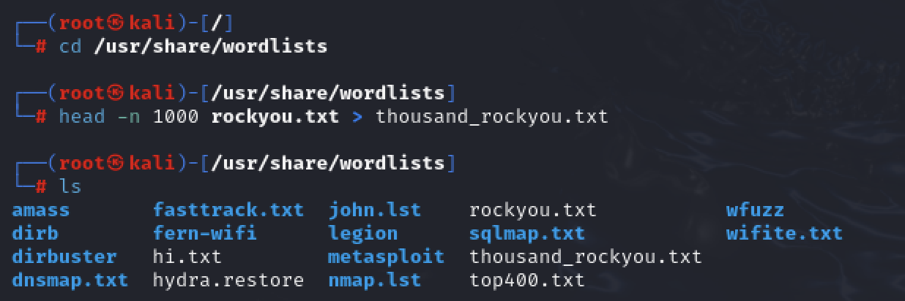

Now that the list is ready we are ready for brute force. 


## Reverse Shell Reconnaissance 

Brute Force is often paired with the knowledge of the names of a certain type of username. We know that **root** is a guaranteed username , but the rest would have to be figured out with a reverse shell. In the reverse shell we could obtain the current user by using the command **whoami** or the list of all of the users in the **passwd** file.

I simplified this command to only show the usernames instead of showing **username , passwd, UID (User ID), GID (Group ID) and the Shell.** This will be useful for **spraying** attack.

```
cut -d: -f1 /etc/passwd
```

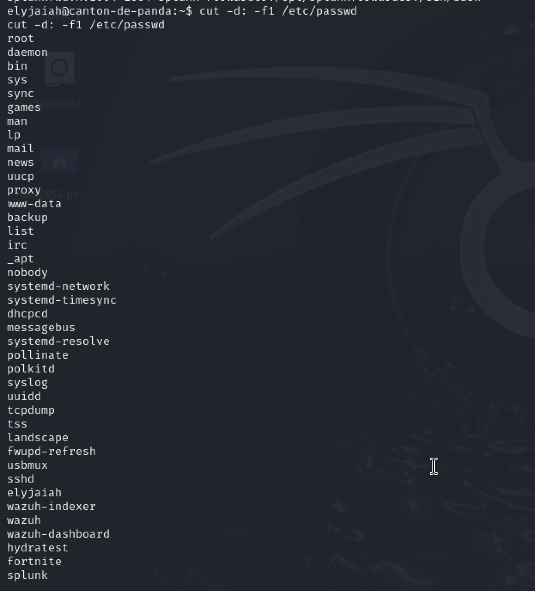

We can see the first user being root all the way to the user **elyjaiah**.

# Brute Force Failure (User: Root)

```
hydra -l root -P 500_rockyou.txt ssh://192.168.64.3 -t 4 -o results.txt 
```
- **-l**: Login for only one user
- **-P**: Multiple passwords will be tested.
- **ssh://192.168.64.3**: Targeting the victim's (Ubuntu) IP through secure shell (port 22).
- **-t**: Thread count running in parallel. 
- **-o**: This flag means "output file" and will save the results of **only if valid credentials are found.**If none are correct the file will remain empty. 


## -t flag breakdown; Stealth vs Speed

### Stealth / Slower (-t 4)

```
hydra -l root -P 500_rockyou.txt ssh://192.168.64.3 -t 4 -o results.txt -vV
```


- 4 threads will be run in parallel 
- Will generate a steady stream of failed logins (hundreds in 10 minutes)
- Easier on the service, harder to notice


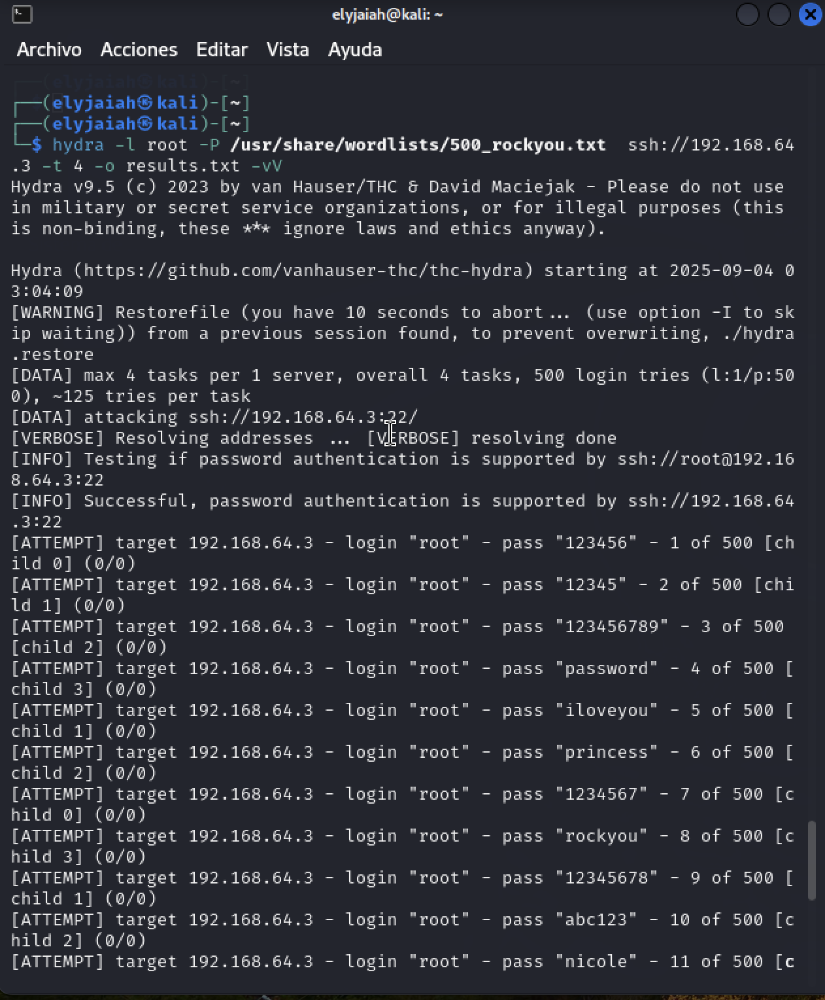

The command is entered and starts to run. 4 Child processes (Child 0-3) are running in parallel until all of the 500 passwords are tested. 

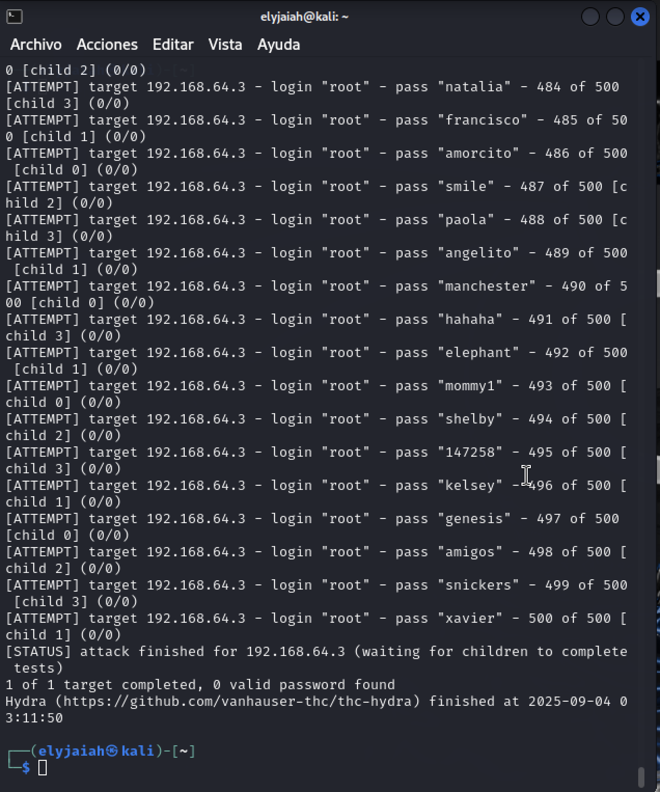

The Brute Force method is finished and **"0 valid password found"** and the file results txt is created in the ~ directory. 

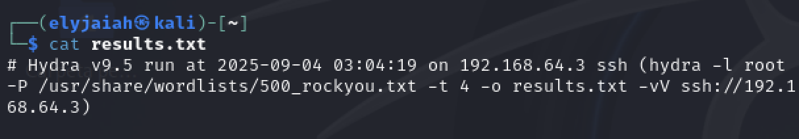

The file as stated before doesn't show us any results. It just summarizes the attack along with the command ran.

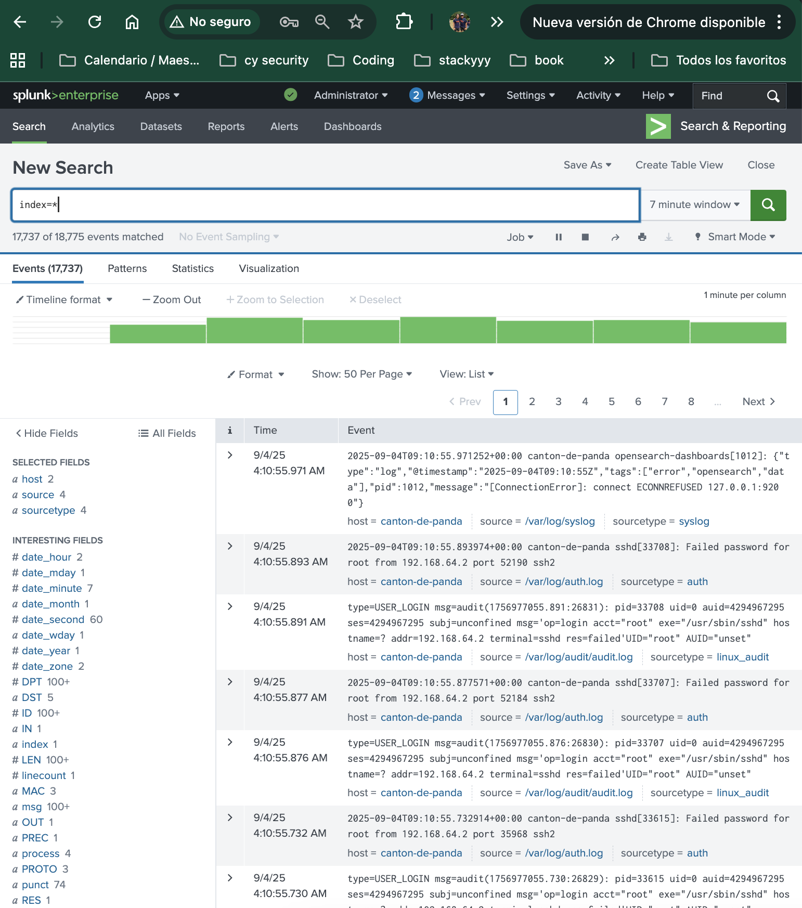

Looking at the logs from a general standpoint we can see 2 of the 7 logs say **"Failed password for root from 192.168.64.2"** with the source coming from `/var/log/auth.log`. With this information we can index specifically the **source** and the text


With this index search we can see the amounts of events narrowed down from 17,000 to around 500. These index search specifically gives us only the failed password attempts. This Brute Force process took around 7 minutes and was target for only **root**.

# Brute Force Success (User : brute-easy )

### Faster / Noisier (-t 16)
The steps are essentially the same except the number of threads is quadrupled to speed up the process and will appear nosier in Splunk.

```
hydra -l root -P 500_rockyou.txt ssh://192.168.64.3 -t 16 -o results.txt -vV
```

- Runs 16 threads in parallel 
- `/var/log/auth.log` will be filled very quickly
- Very noisy and easy for Splunk to detect


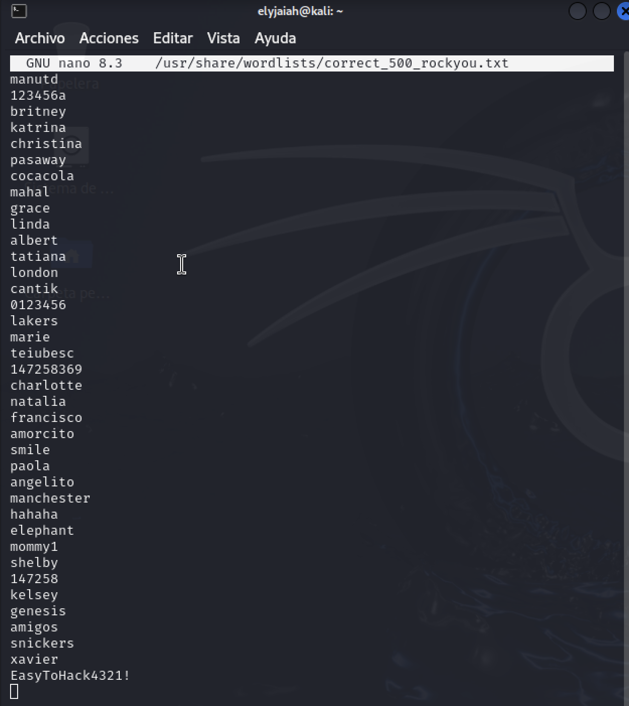

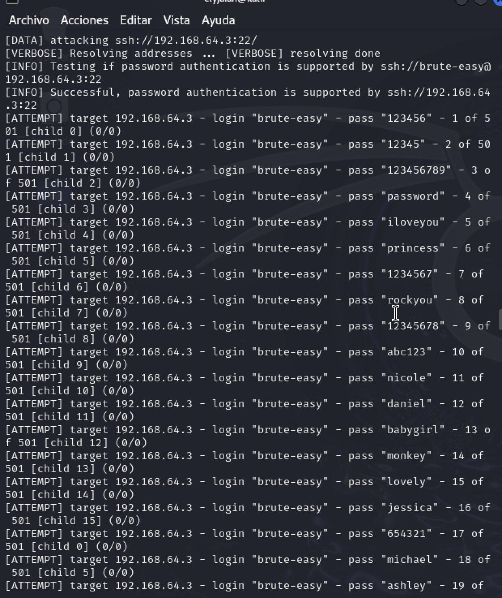


The first two images show the attempt in full effect. Attacking the single user **brute-easy** with the **correct_500_rockyou.txt**  containing the correct password **EasyToHack4321!** added to the 501st line of it. Running 16 threads at the same time in the very verbose mode with the successful attempt being outputted to the file **atempto_exitoso.txt**. The third image highlights the amount of processes running as we can see **[CHILD 0-15]** due to the `-t 16` flag. 


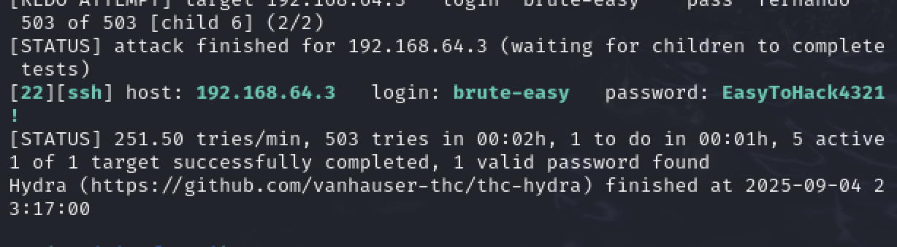


These two photos show the same successful command. The first is from the end hydra command and shows us that the 503 passwords took 2 minutes to complete, 1/503 attempts were successful , and averaged about 251 attempts were averaged per minute. I noticed that this was a lot more detailed than the unsuccessful attempt. 

The second photo shows us the output file of `atempto_exitoso.txt` which gives us the same information about the IP of the victim , the single targeted user , and the successful password amongst the **correct_500_rockyou.txt**. 

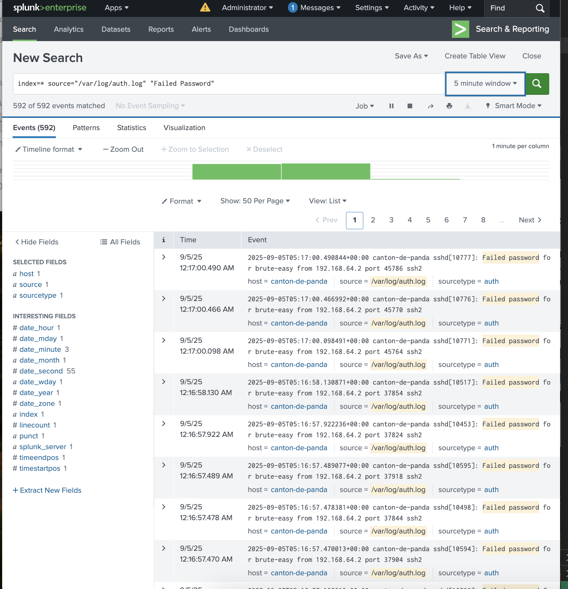

Indexing with the same SPL query as the `-t 4` to save time. This time 592 events matched the SPL query of the **"Failed Password"**. Compared to the `-t 4` which took 5 minutes longer than the `-t 16` which would be   easier to detect. 

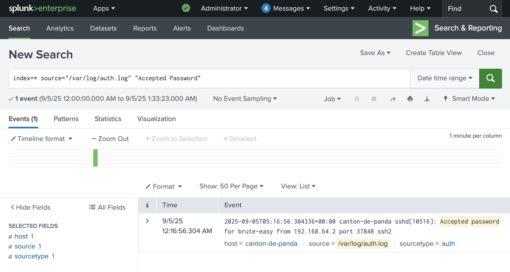

Instead of **"Failed Password"** to search for all of the failed attempts we check to see if there is any successful attempts using **"Accepted Password"**. We see one log pop up giving us the port # , ssh , and the user `brute-easy`.


## MITRE ATT&CK
- **Tactics** - `Credential Access (TA0006)` , Trying to obtain valid credentials

- **Techniques** - `Brute Force (T1110)`, Multiple passwords vs  one account

- **Sub-Technique:** - `Password Guessing (T1110.001)` 

- **Detection Guidance:** - Monitor **/var/log/auth.log** trigger alerts when failures exceed a threshold. 


- **Recommended Respond** - Investigate the source IP, block or limit the IP if confirmed to be malicious, reset the password of the compromised user , and SSH harden the system. 


## Summary
From this brute force simulation , we can clearly see the failed login attempts when targeting **SSH**. Due to  splunk monitoring the log `/var/log/auth.log` log where are able to clearly see the attack and the evidence it leaves behind. Using a targeted SPL query we can filter only authentication events instead of every message containing the word "Password". For the sake of my lab I only used a list of 500 , but the text file of the `rockyou.txt` contains at least 14 million entries which attackers can adjust it how they like. This section highlights the importance of monitoring authentication logs and correlating failed / successful login attempts to identify brute force activity in real time. 