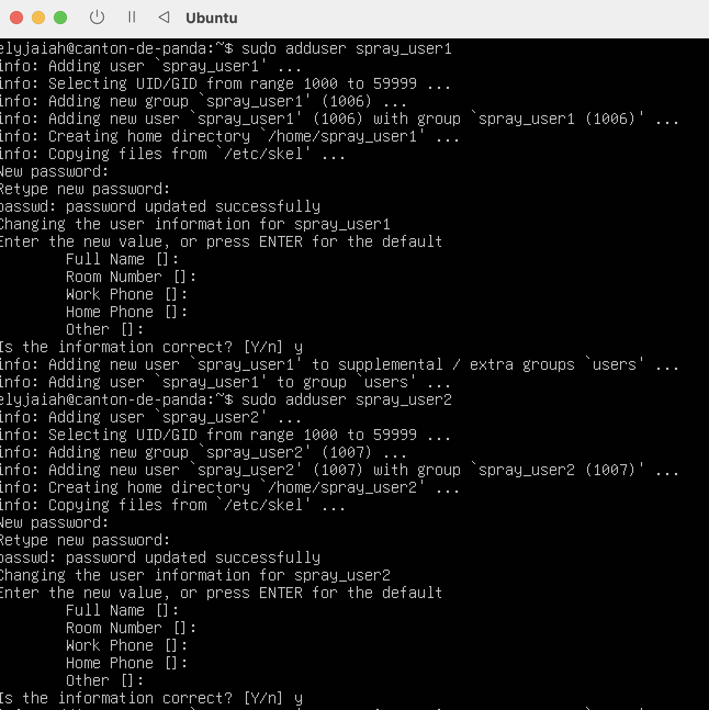
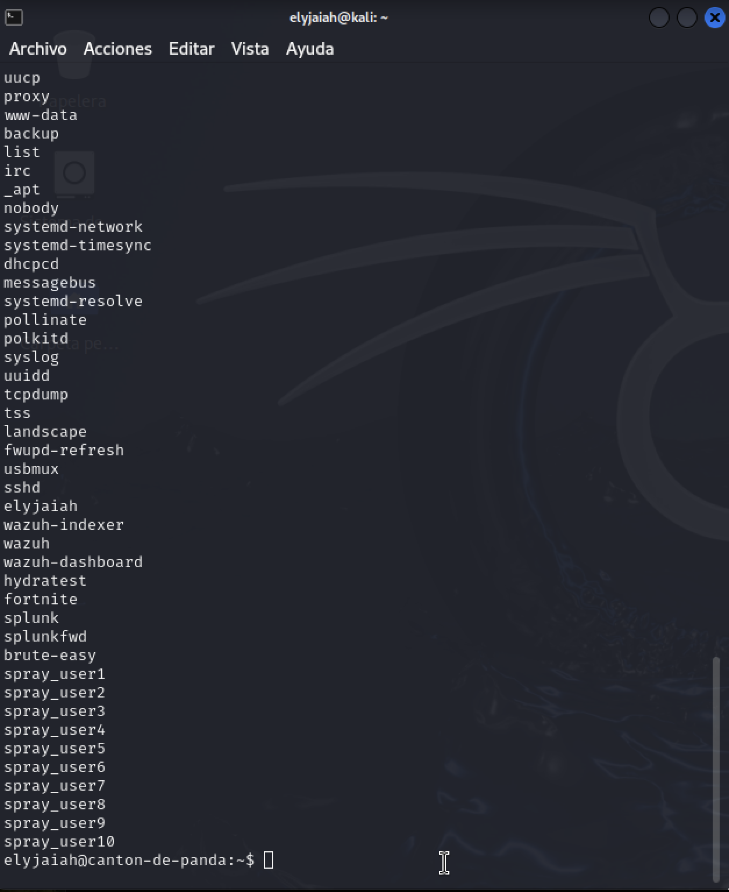
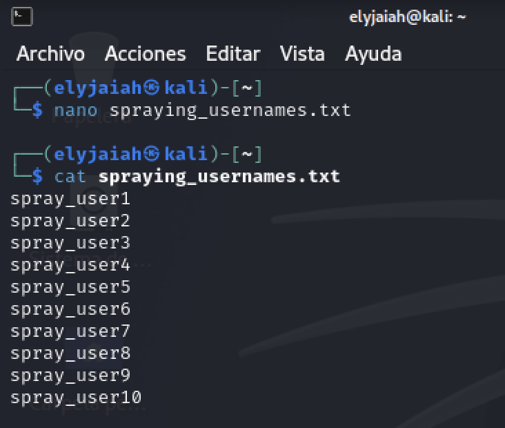
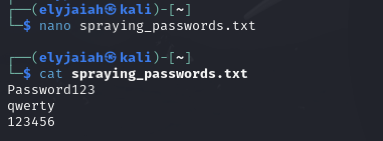
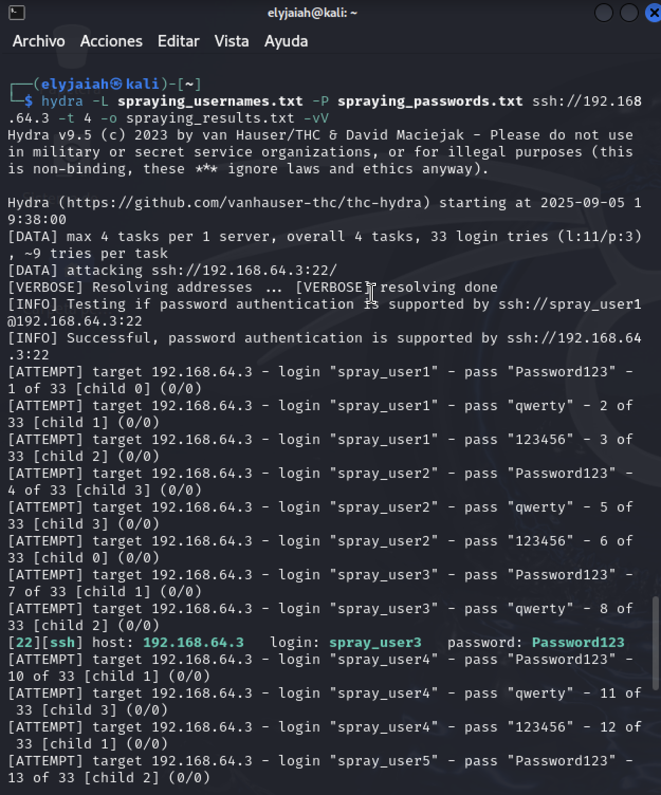
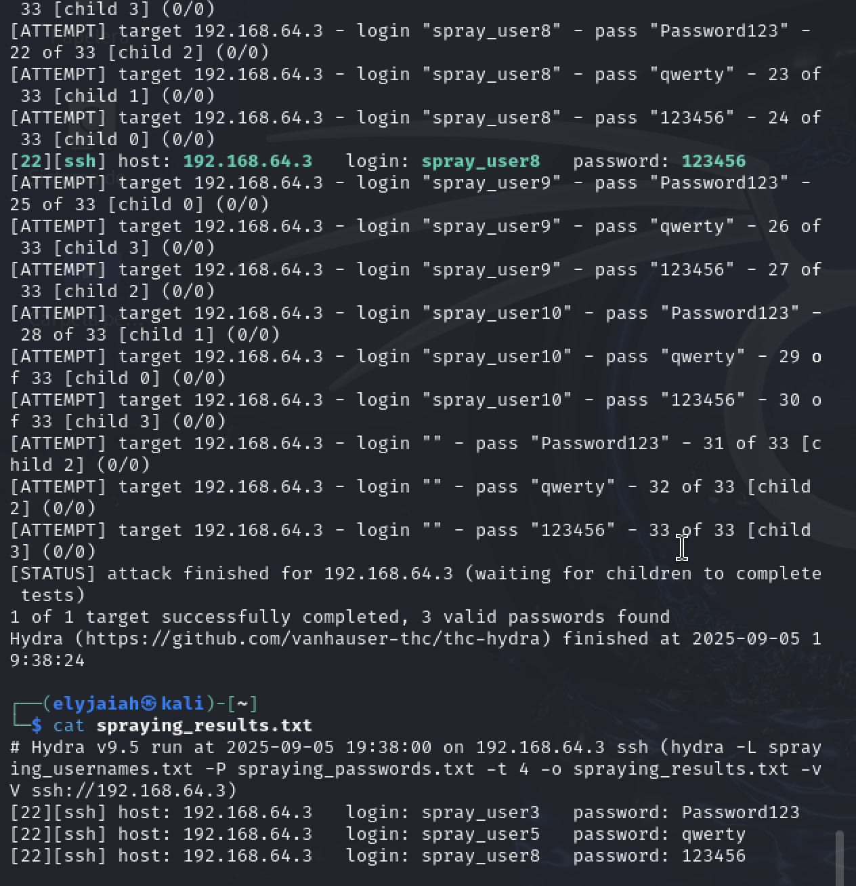
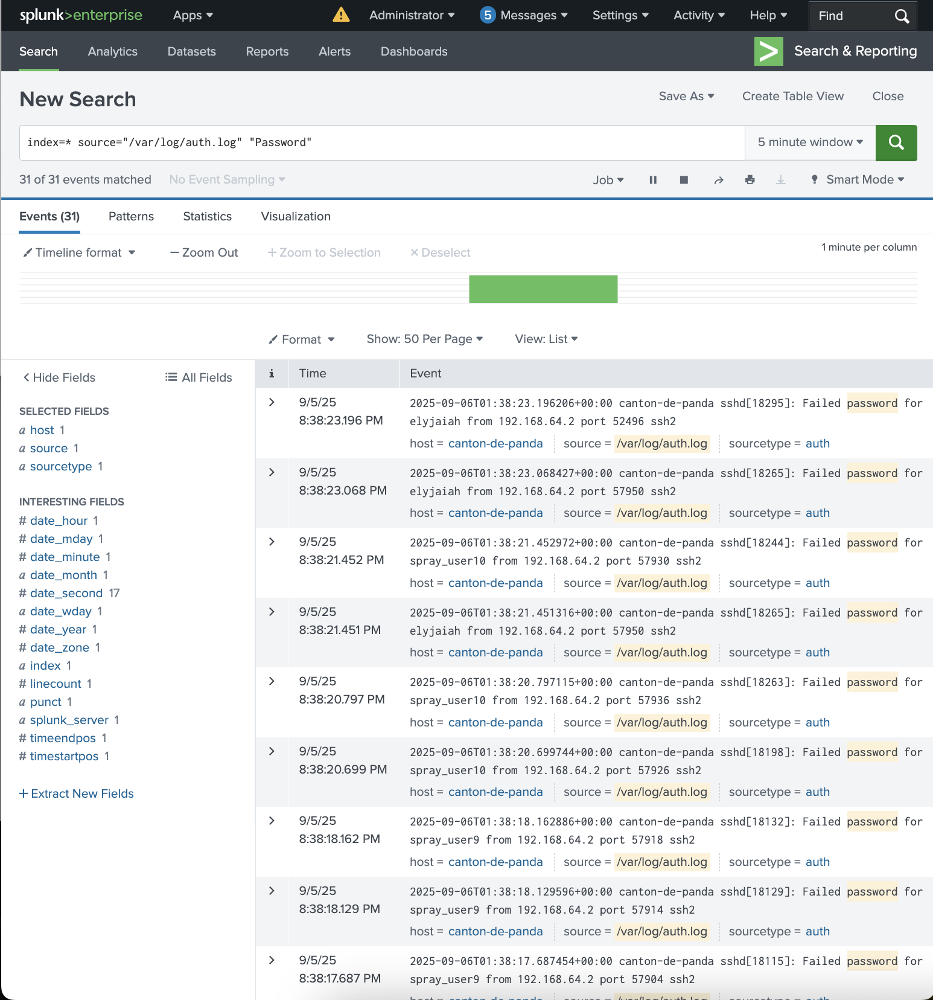

# Password Spraying

## Objective
Opposed to Brute Force testing one account with thousands if not millions of passwords, Spraying attacks multiple user's with a max of 3 passwords to avoid lockout / noisy detection. Splunk will provide us with the multiple failed attempts and the few successful ones. 
## Tool Used
`hydra` - This tool is versatile and can be used for brute force in spraying depending on the flags. 

The flag combo for **brute force** is **-l / -P** which means a list of passwords against one user and the **spraying** flag combo is **-L / -P** which signifies multiple users with a list of passwords (would be 3 max to not cause lockout).

## Users / Password Setup

```
sudo adduser spray_user#
```



With this command test users 1-10 were created so put our spraying into full effect. Like Brute Force this would be paired with the command `cut -d: -f1 /etc/passwd` to get the names of all of the users on the victim. 


With the help of this command we can make a list of all of the users we would like to probe. 



Created a simple text file that contains 3 passwords. This will be the list used against the 10 users. 

- **Password123** 
- **qwerty** 
- **123456**




## Hydra Command
```
hydra -L spraying_usernames.txt -P spraying_passwords.txt ssh://192.168.64.3 -t 4 -o spraying_results.txt -vV
```
- **L** - A capital L means logins for multiple users. 
- **P** - A capital P means a list of multiple passwords. 

- **ssh://192.168.64.3** - Port 22 in the IP of the victim **(192.168.64.3)** 

- **t -4** - The amount of threads running parallel

- **vV** - Shows more than just the verbose attempts from **-V**  and the state , errors , and debugging from **-v**. Together they show every login , certain errors / timeouts, DNS/Host resolution , and progress messages. 





The command is run in these images same as the Brute Force. There is 4 overall task due to the 4 threads. It should've been 30 login attempts, but I accidentally added an empty line at the end of the `spraying_usernames.txt`. For every user we see that the 3 passwords from our list are being tried on each one.

In the second photo from the `hydra` it says that 3 valid passwords were found. In the `spraying_results.txt` it gives us the command that we run , the time it was run , and the successful logins along with the port # , the username , and the password. 

## Splunk


The same SPL queries from Brute Force can used here. 

```
index=* source="/var/log/auth.log"
```

This command will show us all of the traffic passing through the authentication logs which will show failure leading us to the attacker. If we actually wanted to see the Failed/Success attempts **"Password"** would be needed to see both successes/failures and **"Accepted Password"** would need to be used to see the successful attempts. 




## MITRE ATT&CK
- **Tactics** - `Credential Access (TA0006)` , Trying to gain access to valid accounts without triggering lockouts. 

- **Techniques** - `Brute Force (T1110)`, Technically the attacker is trying passwords , but against multiple accounts this time. 

- **Sub-Technique:** - `Password Spraying (T1110.003)`, multiple users with a small password list (3 passwords)

- **Detection Guidance:** - Monitor **/var/log/auth.log** , group users and src-ip's over a 5-10 minutes window, and trigger alerts when failures exceed a threshold. 

- **Recommended Respond** - Investigate the source IP, block or limit the IP if confirmed to be malicious, reset the password of the compromised user , and SSH harden the system. 


## Summary
From this password spraying simulation, there is a clear difference compared to its twin brother, brute force. Spraying targets multiple users instead of focusing on a single account. In Splunk, this appears as multiple **"Failed password"** events, but with changing usernames. While spraying is more stealthy than brute force, Splunk correlation can still reveal the pattern by linking repeated failures from the same source IP followed by a successful login.