# Port Scanner

## Objective
Simulate a reconnaissance phase attack where an attacker scans a victim's machine identify open ports and running services. This will show how Splunk can detect port scanning activity through firewall and system logs.

## Tool Used

`nmap` - A powerful network scanner used by attackers and defenders to enumerate open ports and services

### Flags used

- **-sS (SYN scan / Half-open scan)** - Sends a SYN scan and waits for a response: **SYN-ACK** (open port) and **RST** (closed port). 

- **-sV (Service/Version detection)** - Detect the service and its version that is running (Ex : Apache HTTPS , SSH , mySQL). This will help us find known vulnerabilities in specific versions. 


- **-O (Operating System)** - This analyzes network responses (TTL, TCP window size, etc.) to guess what operating system is running. **Root privileges are required.**

- **-p (Port Specification)** - By default `nmap` scans the most 1000 common ports. 
- **-p 22** - only port 22
- **-p 20-100** - ports 20-100
- **-p-** all of the 65,535 ports

- **-Pn (No ping/Treat host as online)** -  Nmap usually pings to see if the host will respond but with the **-Pn** flag this skips the ping and assume the host is already active . (Useful if the firewall blocks ICMP pings).


## Executed Commands

```
nmap -sS 192.168.64.2
```

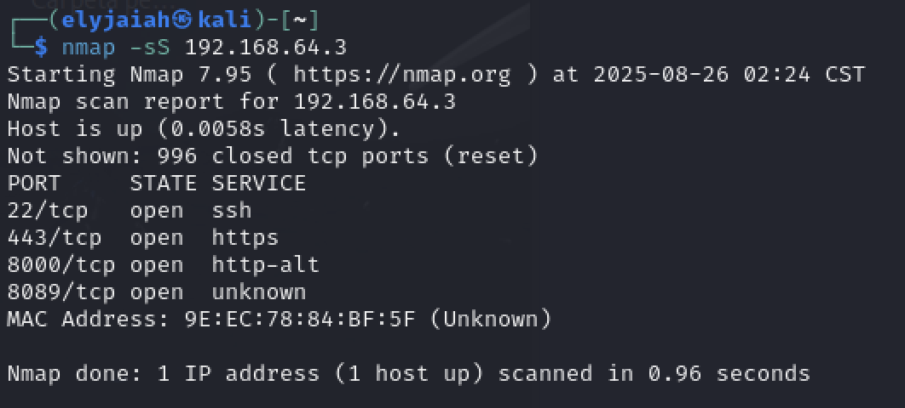

Executed this from the attacker **(Kali)**. By default `nmap` will scan the most common 1000 ports. Out of these 1000 we see that our **ssh | 22 , https | 443 , splunk web ui | 8000 and the management port of splunk | 8089 (splunkd).**
This command generates a certain type of packet pattern (SYN , SYN-ACK, RST) that Wireshark can capture and display. 

### Wireshark Analysis

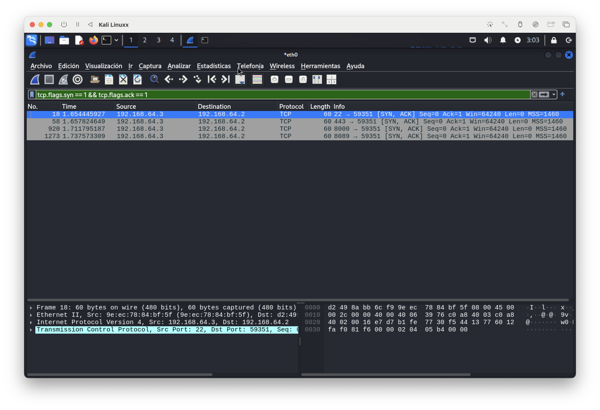

**tcp.flags.syn == 1 && tcp.flags.ack == 1**

This filter returns packets where the **server responded with a SYN+ACK.** This indicates open ports , since the victim replied to the **SYN request** with the 2nd step of the TCP handshake.

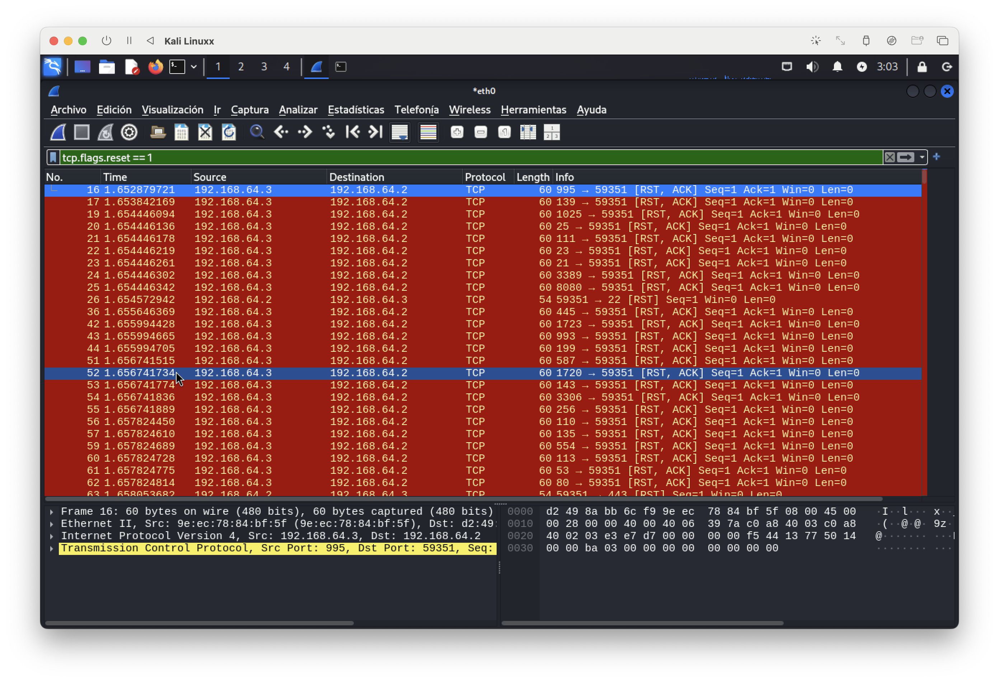

**tcp.flags.reset == 1**

This filter returns all of the closed ports. Replies with  **RST Packet** instead of with a **SYN-ACK** packet demonstrating that the connection attempt was refused.


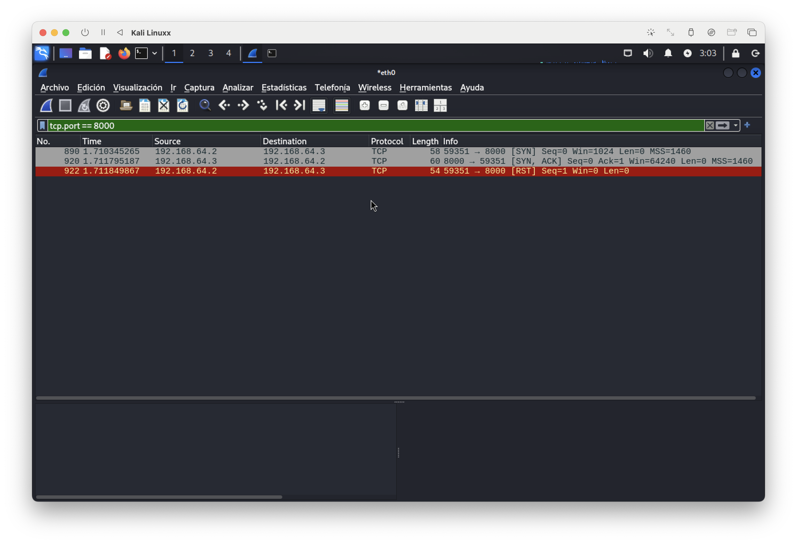

**tcp.port == 8000**

This shows us the packet exchange between for port 8000 . There is a **SYN , SYN-ACK, RST** which is typical of an `nmap` SYN scan. The RST is sent by the attacker instead of completing the handshake , meaning that `nmap` identified the port as open, but left the connection **half-open**.

### Splunk Analysis for -sS

```
index=* SRC=192.168.64.2 DST=192.168.64.3
```

**index="*"** - Searches all of the possible logs
**SRC=192.168.64.2** - This is the IP source address where the attack comes from
**DST=192.168.64.3** - The target of the attack.

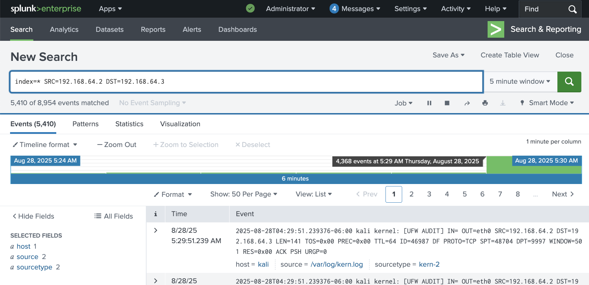

First when the command **-sS** is ran we can see that at least four thousand events were generated. This volume of traffic by itself is a clear indicator of suspicious activity. 

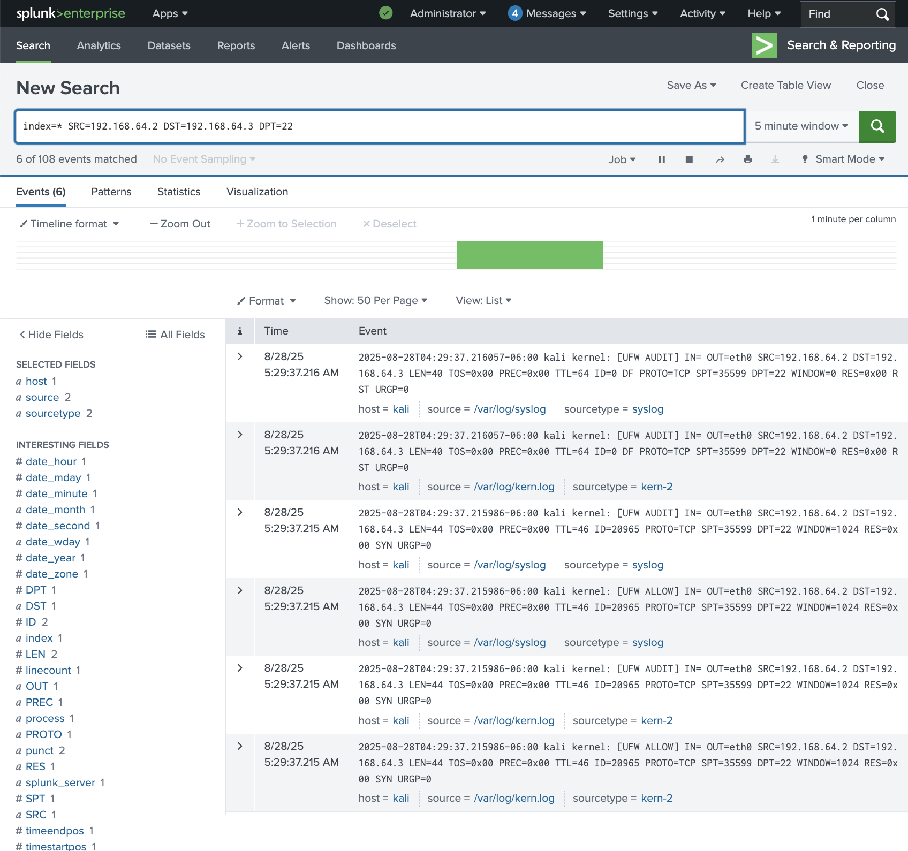

```
index=* SRC=192.168.64.2 DST=192.168.64.3 DPT = 22
```

**DPT = 22** - Secure Shell Destination port.

Splunk shows 6 events , this shows that the port responded with a **SYN-ACK** packet. 


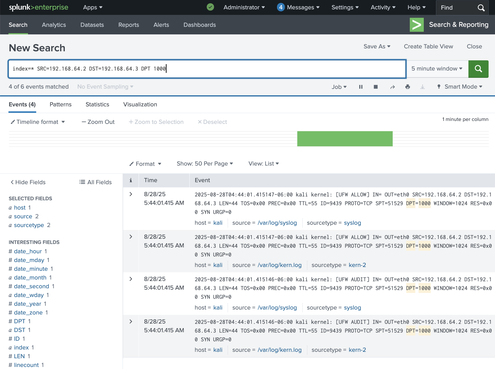

```
index=* SRC=192.168.64.2 DST=192.168.64.3 DPT = 1000
```
**DPT =1000** - Destination port that isn't open.

Splunk this time shows 4 events, this means that the port responded with a **RST** reset packet instead of completing the handshake which means that the port is closed.


**stats count by DPT** - FIl

```
index=* SRC=192.168.64.2 DST=192.168.64.3 | stats count by DPT
```

This command counts how many events were generated per Destination Port. 

- **9997** - Internal port of Splunk (Forwarders to Indexers), which has more than 1300 logs. 

- **1514/1515** - Other port monitored by Splunk.

- **22 (ssh), 443 (https), 8000 (Web UI), 8089(Splunk Management)** - These were the open ports (6 events) that were identified by the scan.

- **The rest of the ports** - The handshake was cut short by the **RST** packets. (4 events)

### Service/Version Detection (-sV)
```
nmap -sV 192.168.64.3
```

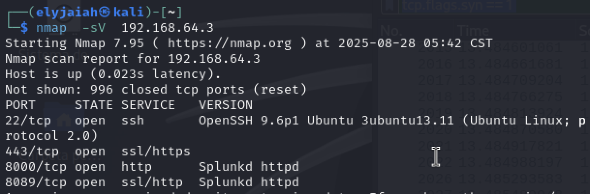

- **22/tcp** - **SSH** - OpenSSH 9.6p1 (Ubuntu Linux)

- **443/tcp** - **HTTPS** - This was detected as SSL but the service wasn't fully identified

- **8000/tcp** - **Splunk Web UI** - (Splunkd httpd)

- **8089/tcp** - **Splunk Management Port** - (Splunkd httpd)

This lets us know port than the port being "open". This tells us exactly what software is running , which is more useful for vulnerability mapping. 


### Operating System Detection **(-O)**
```
nmap -O 192.168.64.2
```

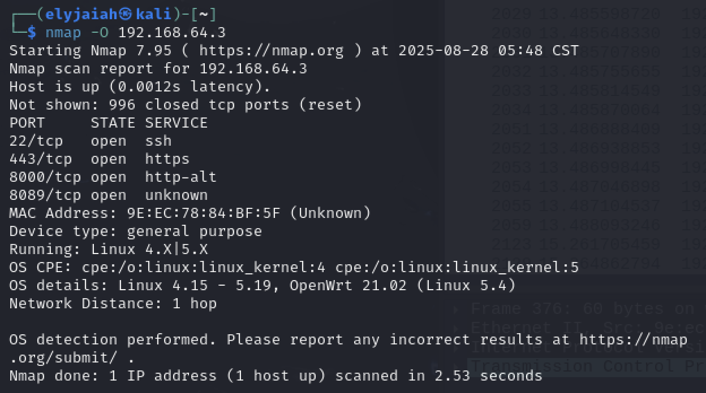

The **-O** flag performs OS fingerprinting by analyzing how the system responds to TCP/IP probes such as (TTL , TCP window size , ICMP responses , etc.). Different OS systems have fingerprints that can be identified remotely. 


- **Host:** Linux (kernel 4.x - 5.x)

- **Device Type:** General Purpose Server

- **OS details:** Linux 4.15 - 5.19 , possible match to OpenWrt 21.02 or MikroTik RouterOS 7.x

This information is extremely helpful because it narrows down the **potential** vulnerabilities that might apply to the target host. Attackers can search for privilege escalation vulnerabilities that can be applied to this specific version. If the system is actually running **OpenWrt 21.02 or MIKroTIk RouterOS** , it could be vulnerable to device-specific exploits which would definitely increase the risk of a full compromise. 


### Full Port Scan (-p-)

```
nmap -p- 192.168.64.3
```
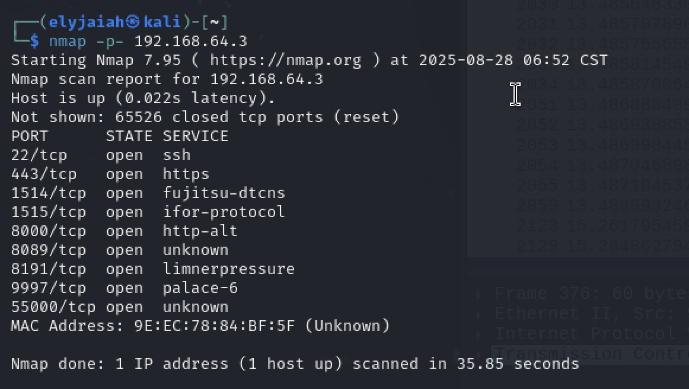

Instead of scanning the default top 1000 ports the `-p` flag tells nmap to scan **ALL** of the 65,535 ports. Due to touching every single port , thousands of packets and logs will appear. 

**55000** - This is a new "unknown" port that we've seen that could be a possible vulnerability for an attacker.

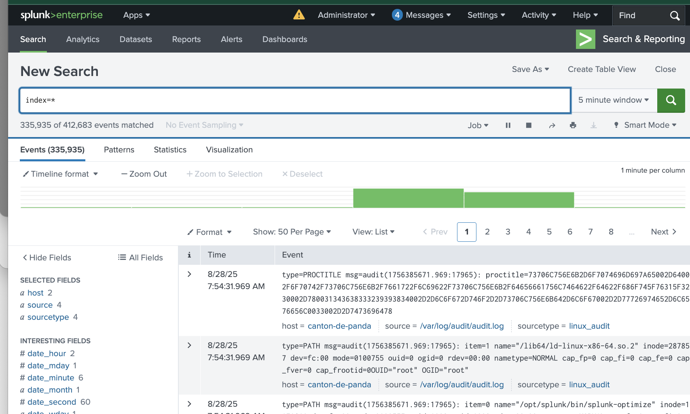

From this screenshot we can see that exactly **335,935** logs were generated in 2 minutes which is an absurd amount of traffic compared to the couple thousand that a normal scan generates. 


## MITRE ATT&CK
- **Tactics** - `Reconnaissance (T1046)`
- **Techniques** - `Network Service Scanning (T1046)`


- **Detection Guidance:** - High volume of connection attempts across plenty destination ports from the same Source IP. Look for lots of half "3-way handshakes". 


- **Recommended Respond** - Temporarily block / rate-limit the scanning IP , investigate the source , check if it internal or external . If it is internal , find the compromised host / misconfigured scanner , and harden exposed services. 

## Summary
From all of this data collected we can see that **nmap** is an efficient tool for collecting data and providing attackers with critical reconnaissance data: open ports, running services, software version, and even the operating system. However, the trade off of nmap is its visibility. Tools like **Wireshark** and **Splunk** make port scanning easy to detect due to the **sheer volume of network packets and logs generated.** Defenders would easily be able to catch on. 