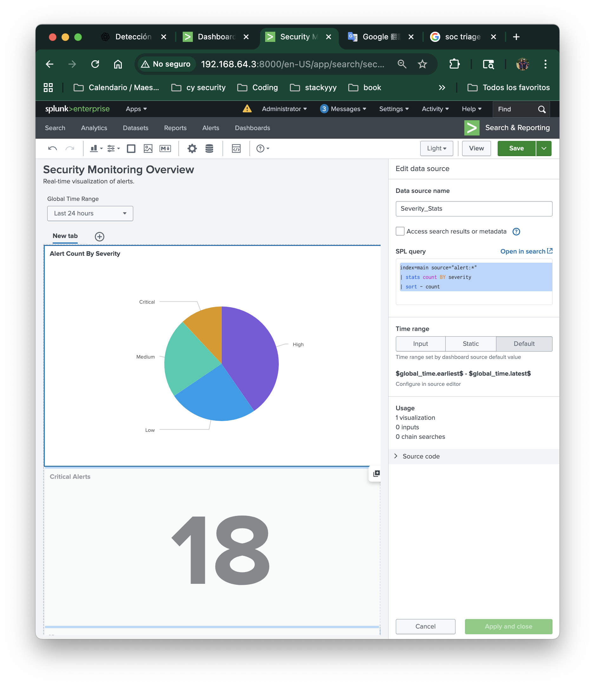
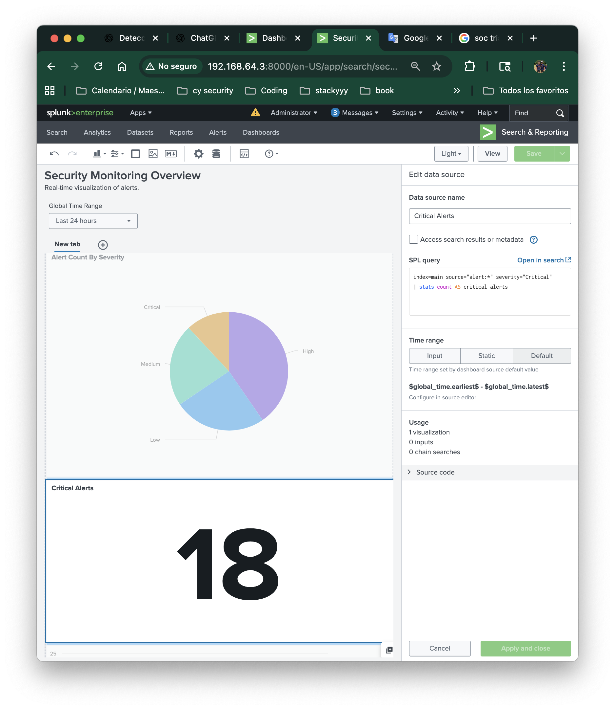
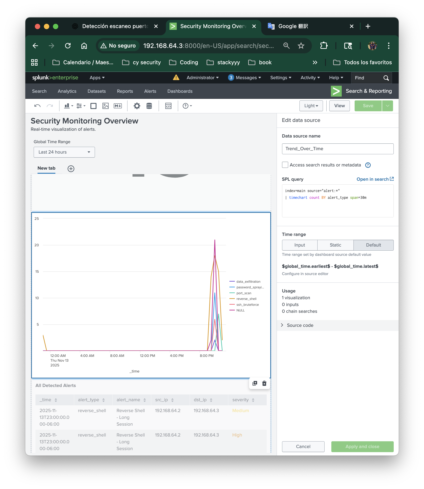
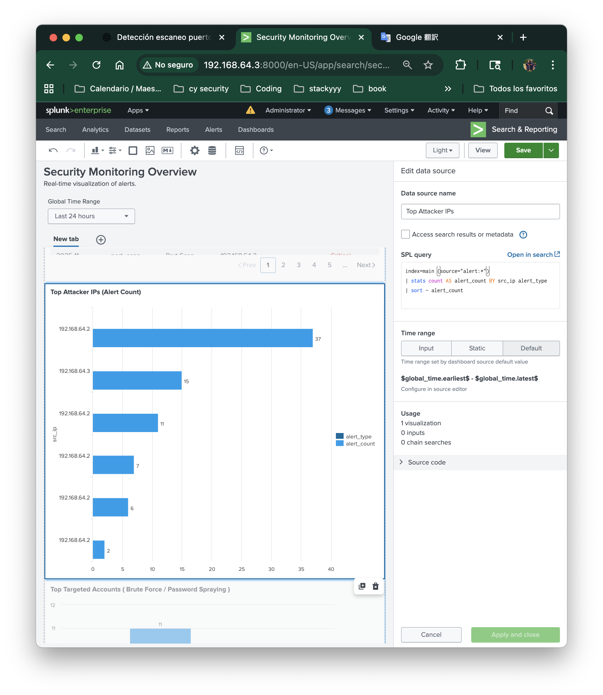
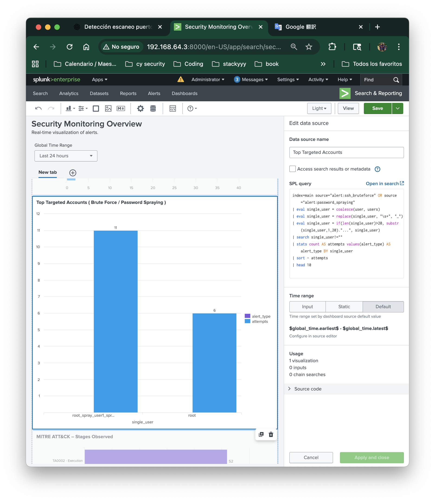
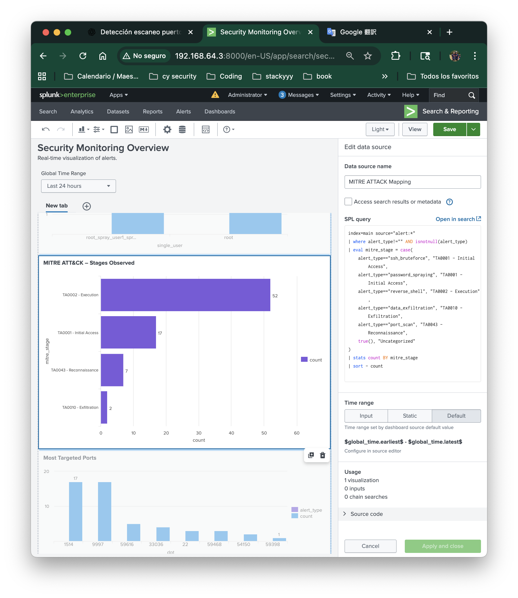
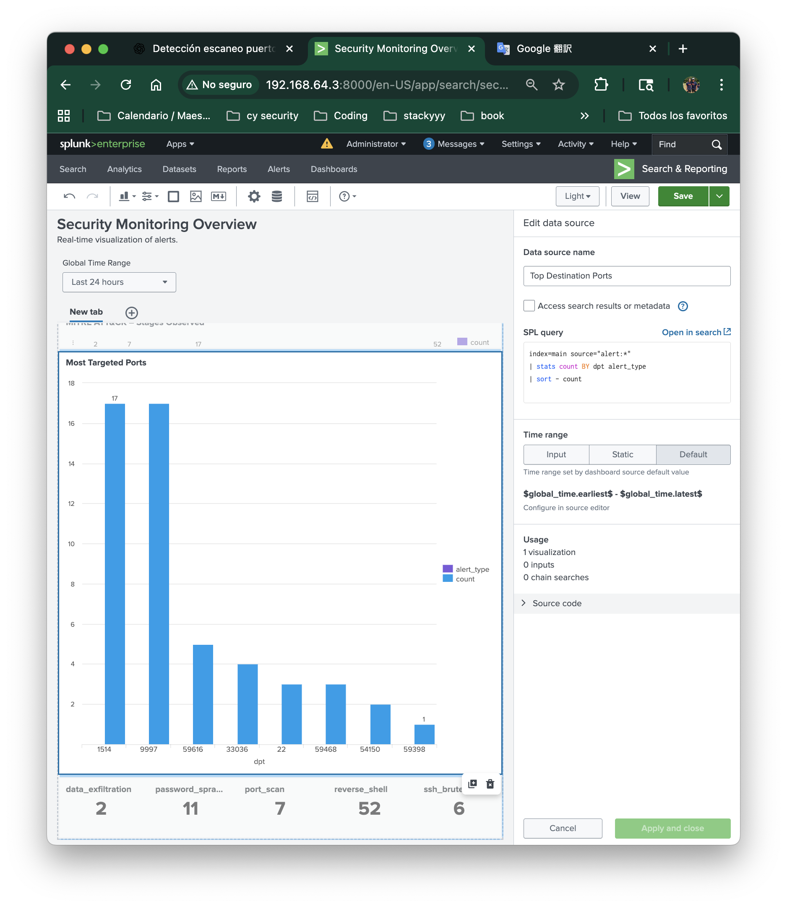
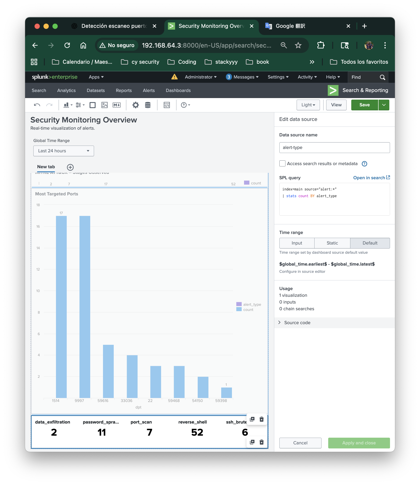

# Splunk SIEM Dashboards

## Objective
Visualize and monitor the key security detections configured in Splunk through interactive dashboards. Alerts are converted into visual intelligence for quick analysis.

## Dashboard 1: Security Monitoring Overview
**Purpose:**
Provide a global view of all triggered detections over time, grouped by attack type and severity.

## **Panels**
- **Alert by Severity** (Pie Chart)
- **Critical Alerts** (Single Value)
- **Alerts Over Time** (Timechart)
- **All Detected Alerts** (Table)
- **Top Attackers IPs** (Bar Chart)
- **Top Targeted Accounts** (Bar Chart)
- **MITRE ATT&CK** - Stages Observed (Bar Chart)
- **Most Targeted Ports** (Bar Chart)
- **Alert Totals by Type** (Single Value Grid)


## Alert By Severity 
### SPL
```
index=main source="alert:*"
| stats count BY severity
| sort - count

```
- Searches all alert events written by detection rules (`source="alert:*`)
- Groups alerts by **severity** and **alert type**
- Counts how many alerts fall into each category

### Significance 
This provides a quick visual breakdown of the alert severity distribution. 



## Critical Alerts
### SPL
```
index=main source="alert:*" severity="Critical"
| stats count AS critical_alerts
```
- Filters only event where severity = Critical
- Returns a single value representing the total count

### Significance 
Gives immediate visibility of the highest-priority threats requiring urgent response.



## Alerts Over Time
### SPL
```
index=main source="alert:*"
| timechart count BY alert_type span=30m
```
- Searches all alerts
- Groups them into 30-minute time buckets (`span=30m`)
- Splits by alert type

### Significance 
Shows when the attacks occurred. This helps correlate attack sequences. 



## All Detected Alerts
### SPL
```
index=main source="alert:*"
| table _time alert_type alert_name src_ip dst_ip severity
| sort - _time
```
- Displays all raw alerts fields
- Sorted by newest first

### Significance 
This is considered to be a SOC triage table. Analysts use this to drill into specifics


## Top Attackers IPs 
### SPL
```
index=main source="alert:*"
| stats count AS alert_count BY src_ip alert_type
|sort - alert_count
```
- Counts how many alerts each IP generated
- Identifies aggressive attacker machines

### Significance 
Shows which hosts are launching the most attacks - internal / external



## Top Targeted Accounts
### SPL
```
index=main source="alert:*" (alert_type="ssh_bruteforce" OR alert_type="password_spraying")
| stats count AS attempts BY user
| sort - attempts
```
- Filters for account-based attacks only
- Counts login attempts per username

### Significance 
Gives us new on which accounts are being targeting during credential attacks




## MITRE ATT&CK – Stages Observed
### SPL
```
index=main source="alert:*"
| stats count BY mitre_stage
| sort - count
```
- Each alert rule tags itself with `mirte_stage` value
- Groups alerts by attack phase

### Significance 
Maps detections to ATT&Ck to show attacker progression (Recon → Execution → Exfiltration )




## Most Targeted Ports
### SPL
```
index=main source="alert:*"
| stats count BY dpt alert_type
| sort - count
```
- Looks at `dpt` extracted by the detections
- Counts how often each port appears in alerts

### Significance 
This reveals reverse shell ports, brute force ports, and the most scanned ports.




## Alert Totals By Type
### SPL
```
index=main source="alert:*"
| stats count BY alert_type
```
- Summarizes alert volume by type
- Builds a grid with all of the attacks

### Significance 
Instant visibility of which detections fire the most





