# Splunk Universal Forwarder Setup on Kali Linux

## Objective 
Configure Splunk UniversalForward on Kali Linux to send log data to the Splunk Enterprise SIEM running on Ubuntu Server 24.04.

## Step 1 - Download the Splunk Universe Forwarder

```
wget -O splunkforwarder.deb "https://download.splunk.com/products/universalforwarder/releases/9.4.3/linux/splunkforwarder-9.4.3-237ebbd22314-linux-amd64.deb"
```
**wget** - Downloads the installer and saves it to the name `splukforwarder.deb`

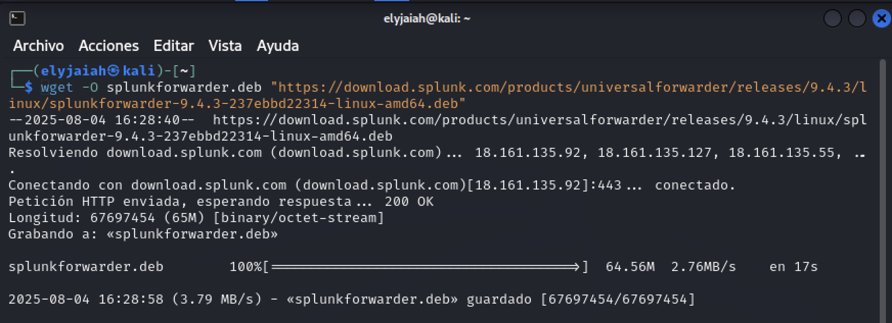

Downloaded the `.deb` package for the forwarder directly from the Splunk website. This will be used to collect and send log data from Kali Linux (Forwarder) to Ubuntu (Splunk Enterprise). 


## Step 2 - Install the package
Install the download package
```
sudo dpkg -i splunkforwarder.deb
```
**dpkg** - Debian package manger that will extract and configure the Universal Forwarder in the `/opt/splunkfowarder` directory.

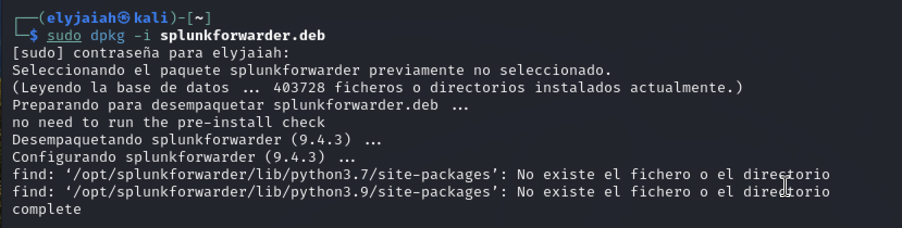

## Step 3 -  - Initialize and Start Splunk Universal Forwarder
```
sudo /opt/splunkforwarder/bin/splunk start --accept-license --answer-yes
```
This command allows us to interact with Splunk from the command line and we accept the license agreement because we are setting up for the first time. 

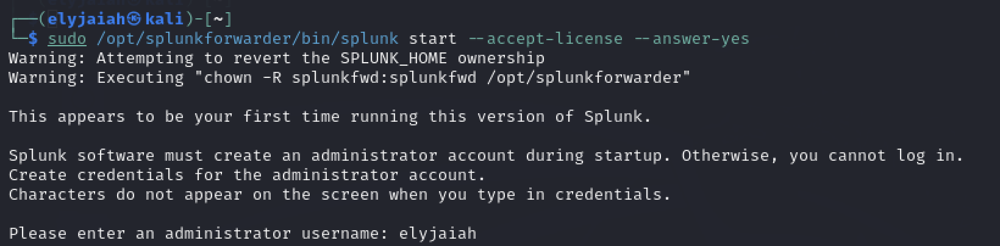


## Step 4 - Add Paths to Monitor
```
sudo /opt/splunkforwarder/bin/splunk add monitor /var/log/auth.log

sudo /opt/splunkforwarder/bin/splunk add monitor /var/log/syslog

sudo /opt/splunkforwarder/bin/splunk add monitor /var/log/kern.log


sudo /opt/splunkforwarder/bin/splunk add monitor /var/log/dpkg.log
```
We decide which log files we want to monitor / send to the server. 
- authentication logs
- system logs
- kernel messages 
- Installation History

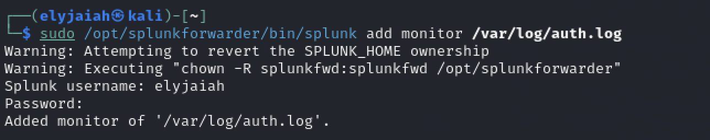

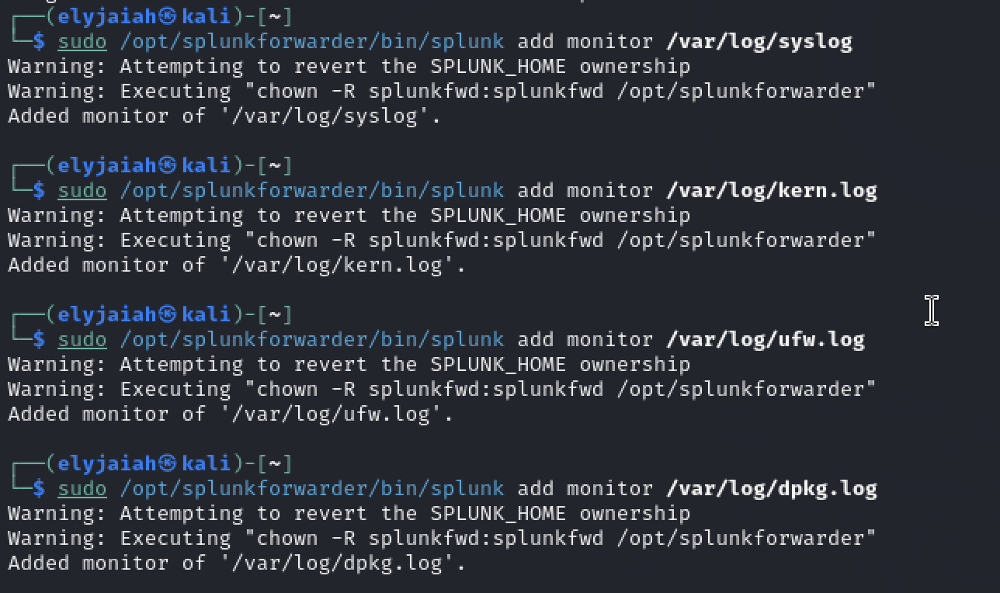


## Step 5 - Add Forwarding Server
```
sudo /opt/splunkforward/bin/splunk add forward-server 192.168.64.3:9997
```


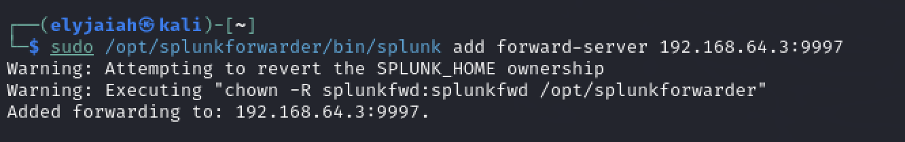

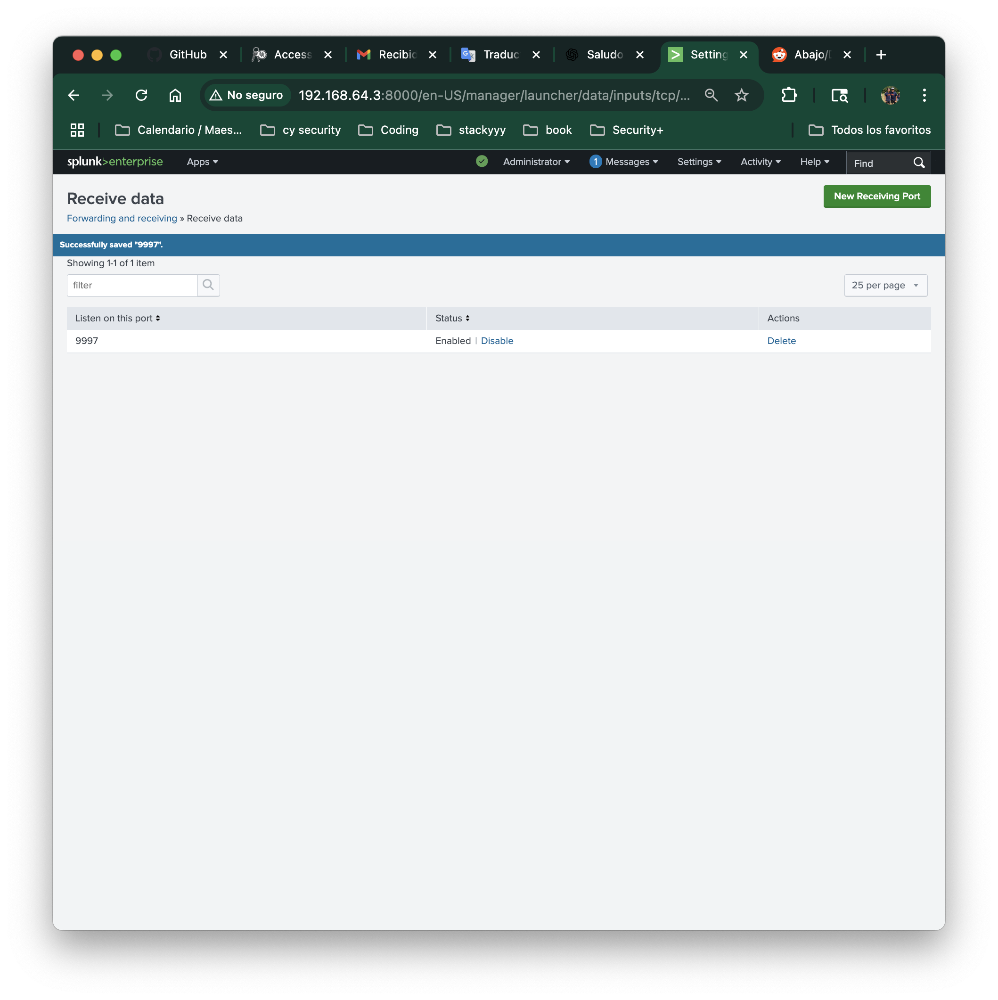


## Step 6 - Verifying the server and the monitors 
```
sudo /opt/splunkforwarder/bin/splunk list forward-server
```
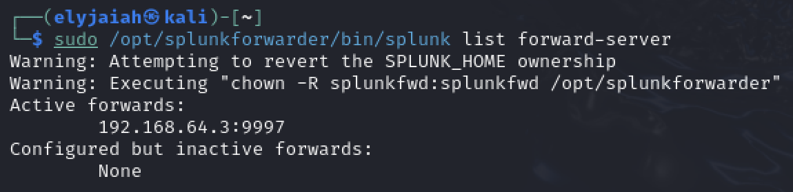


```
sudo /opt/splunkforwarder/bin/splunk list monitor
```

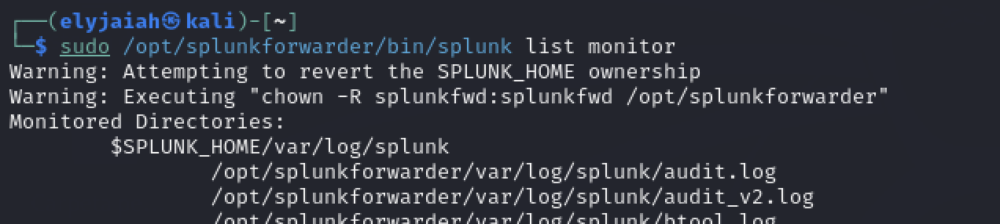

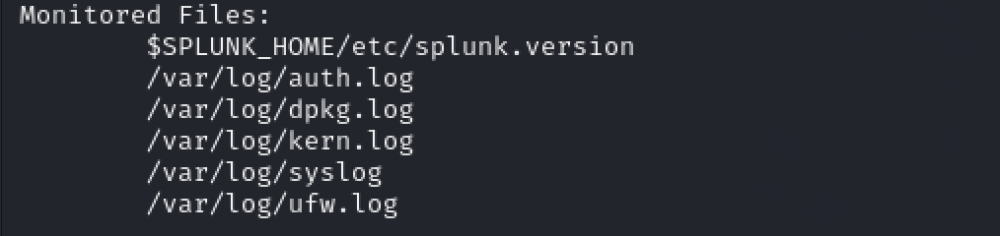

We confirm that our forwarder is set up correctly . From the screenshots we can see that we have our forwarder and our logs.

## Step 7 - Confirm Data Received in Splunk Enterprise

Finally, we confirm that logs from Kali machine are being received by the Splunk Enterprise SIEM on Ubuntu. We open the **Search & Reporting** app and run this command. 


```
index=* host ="kali"
```

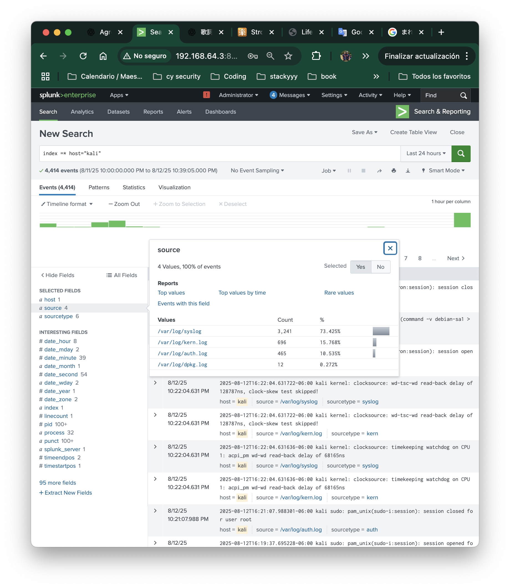

I clicked on the "source" on the left hand side and here we can see all of our monitors. 

## Rundown 

At this point, the Splunk Universal Forwarder running on Kali Linux is successfully sending logs (e.g., auth.log, syslog, kern.log) to the Splunk Enterprise SIEM on Ubuntu. We verified this by searching for `host=kali` in the Splunk Search app and confirming incoming events. Everything is now ready to analyze logs from the Kali machine in real-time.