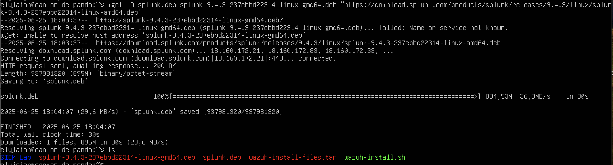
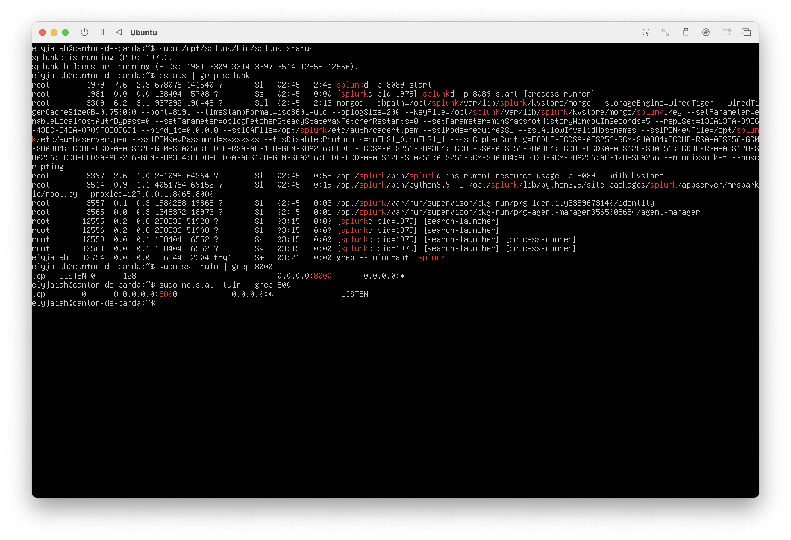
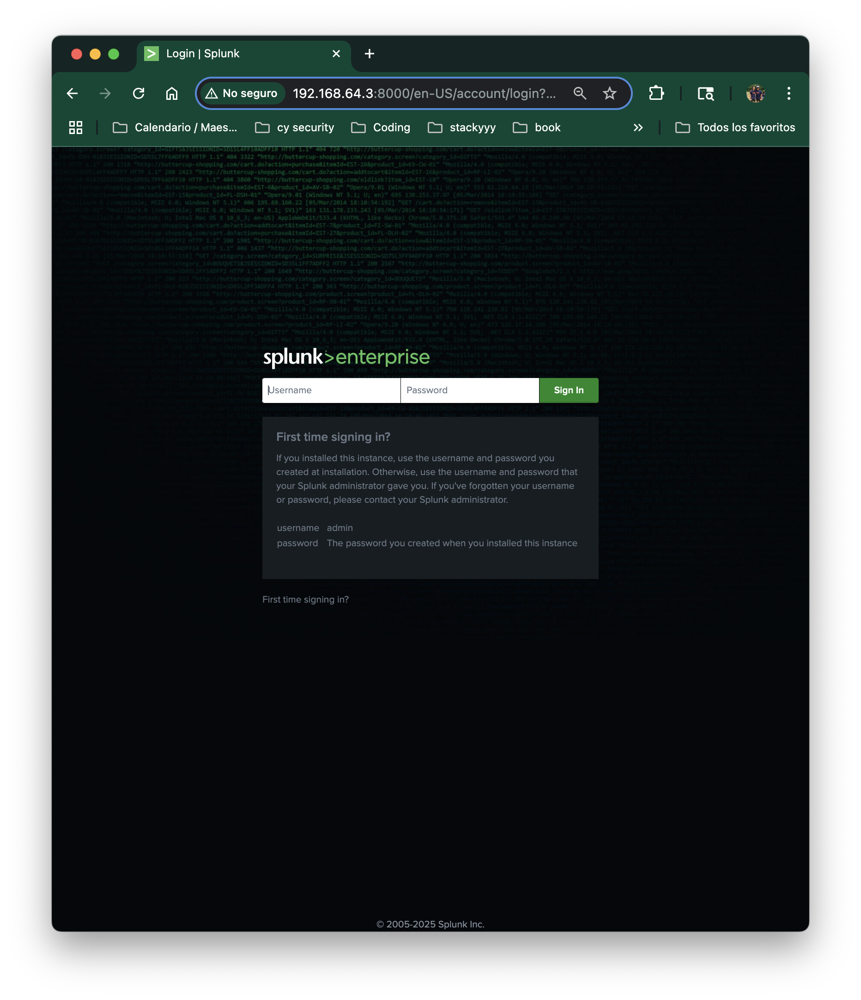
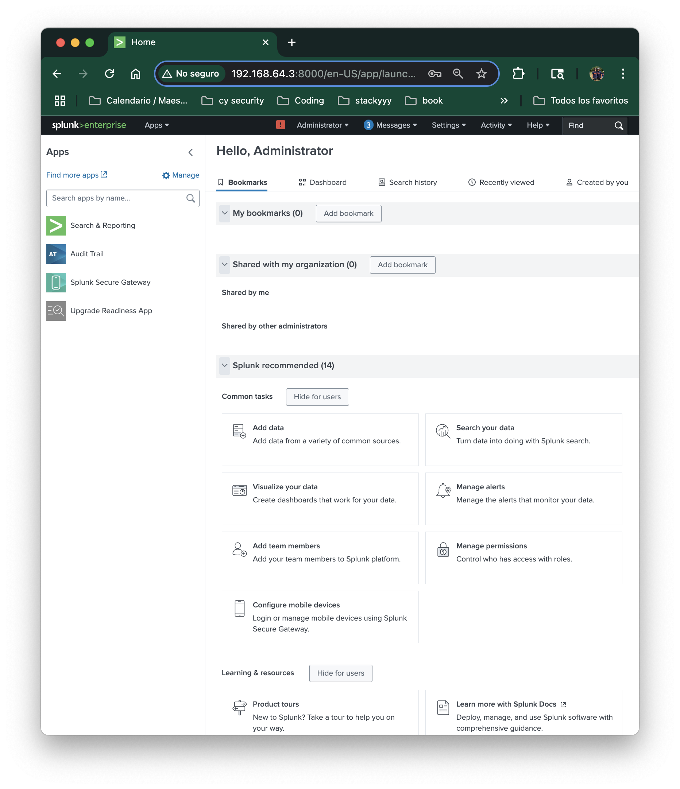

# Splunk Enterprise Setup on Ubuntu Server

## Objective
Install and configure Splunk Enterprise as the central SIEM server in a homelab environment using Ubuntu Server 24.04.

## Step 1 - Downloading Splunk

Use the `wget` to download the .deb installer link and rename it to `splunk.deb` for simplicity:

```
wget -O splunk.deb "https://download.splunk.com/products/splunk/releases/9.4.3/linux/splunk-9.4.3-237ebbd22314-linux-amd64.deb"
```



## Step 2 - Installing Splunk
Install the package using dpkg:

```
sudo dpkg -i splunk.deb
```


## Step 3 - Starting Splunk for the first time
Accept the license agreement and initialize the service:

```
sudo /opt/splunk/bin/splunk start --accept-license --answer-yes
```

### 
Command to Enable Splunk to start at boot
```
sudo /opt/splunk/bin/splunk enable boot-start
```


## Step 4 - Verifying the Splunk is running

### Option 1 - Check the Listening Ports (Port 8000 is the default Splunk Web UI)

```
sudo ss -tuln | grep 8000
```
or 
```
sudo netstat -tuln | grep 8000
```

- **ss -tuln** = Show TCP(t) , UDP(u) , Listening (-l) , Numeric Sockets (-n)
- **netstat -tuln** = Same idea but it is an older command. 
- **grep (global regular expression point) 8000** = Filters t o show only Splunk's Web Interfaces (port 8000)

### Option 2 - Check Process Status 
```
ps aux | grep splunk
```

**ps aux:** - Used for obtaining information about running processes. 

**grep splunk** - Filtering by the word `splunk`

### Option 3 - Use Splunk's Native Status Check

```
sudo /opt/splunk/bin/splunk status
```

- Will show us that `splunkd` is running and also the PID numbers related to the Splunk Services.

### What is splunkd?
- `splunkd` is the core background deamon (service) that runs Splunk.
- It handles data indexing, searching, scheduling, and web services. 
- You will see multiple `splunkd` processes - that's normal. 


### Picture of the commands



## Step 5 - Final Result

After completing all of the previous steps . I was able to connect from my mac to Splunk Enterprise server using following URL:
```
http://192.168.64.3:8000
```
To find the IP address of the server, I used:
```
hostname -I
```
This shows the local IP address assigned to Ubuntu. I then opened the address in my Mac Browser and was greeted by the Splunk login screen.






## Reflection 
Setting up splunk has taught me the foundation of how SIEMs ingest , display , and index data for Security monitoring. 