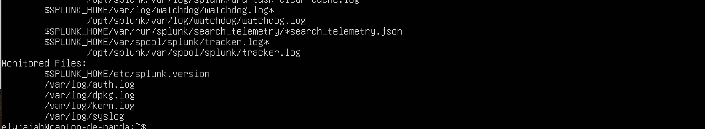
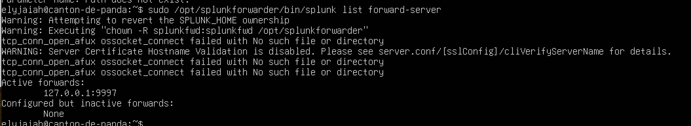
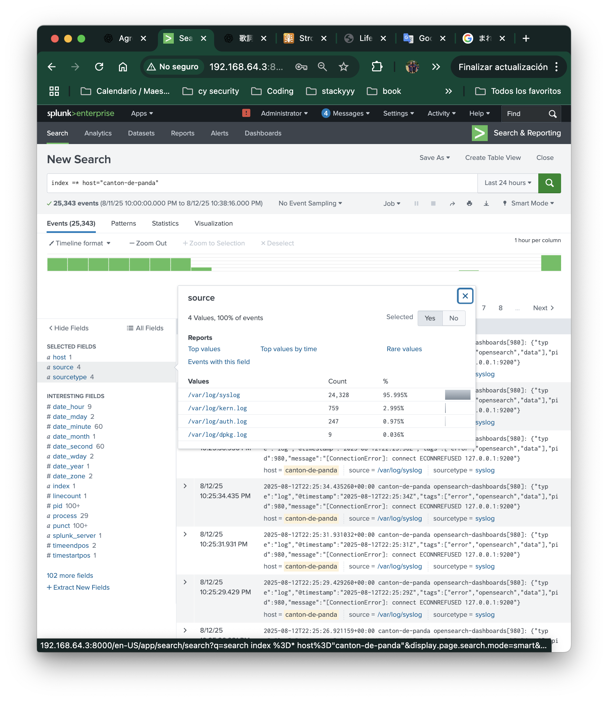

# Splunk Universal Forwarder Setup on Ubuntu

## Objective 
To configure the Splunk Universal Forwarder on the same system as the Splunk Enterprise specifically so we can detect a reverse shell attack. 

## Step 1 - Download / Install the Splunk Universe Forwarder

```
wget -O splunkforwarder.deb "https://download.splunk.com/products/universalforwarder/releases/9.4.3/linux/splunkforwarder-9.4.3-237ebbd22314-linux-amd64.deb"

sudo dpkg -i splunkforwarder.deb
```
**wget** - Downloads the installer and saves it to the name `splukforwarder.deb`

**dpkg** - Debian package manger that will extract and configure the Universal Forwarder in the `/opt/splunkfowarder` directory.

## Step 2  - Initialize and Start Splunk Universal Forwarder
```
sudo /opt/splunkforwarder/bin/splunk start --accept-license --answer-yes
```
This command allows us to interact with Splunk from the command line and we accept the license agreement because we are setting up for the first time. 


## Step 3 - Add Paths to Monitor
```
sudo /opt/splunkforwarder/bin/splunk add monitor /var/log/auth.log

sudo /opt/splunkforwarder/bin/splunk add monitor /var/log/syslog

sudo /opt/splunkforwarder/bin/splunk add monitor /var/log/kern.log

sudo /opt/splunkforwarder/bin/splunk add monitor /var/log/dpkg.log
```
We choose these logs because they are most likely to contain evidence of a reverse shell attack . 
- **auth.log** - Authentication attempts and sessions
- **syslog** - General system activity
- **kern.log** - Kernel Messages (could show unusual network activity)
- **dpkg.** - Package changes


## Step 4 - Add Forwarding Server

```
sudo /opt/splunkforwarder/bin/splunk add forward-server 127.0.0.1:9997
```

**127.0.0.1** - The Splunk Enterprise is already installed on ubuntu so we will use the loopback IP.

**9997** - Default receiving splunk port for **forwarders**

To confirm that Splunk Enterprise is 


## Step 5 - Verifying the server and the monitors 

```
sudo /opt/splunkforwarder/bin/splunk list monitor
sudo /opt/splunkforwarder/bin/splunk list forward-server
```





## Step 6 - Confirm Data Received in Splunk Enterprise

Finally, we confirm that logs from Ubuntu are being received by the Splunk Enterprise SIEM on Ubuntu. We open the **Search & Reporting** app and run this command. 


Confirm our hostname in Ubuntu and then put in the search bar. 

```
index=* host ="canton-de-panda"
```



This query shows us all of the logs within the past 24 and we will deep dive into this in the other sections. 

## Rundown 

Ubuntu's UF will now forward logs to the Enterprise on the same machine (Ubuntu | 127.0.0.1:9997). We will now be able to launch a reverse shell and see indicators of splunk in real time. 